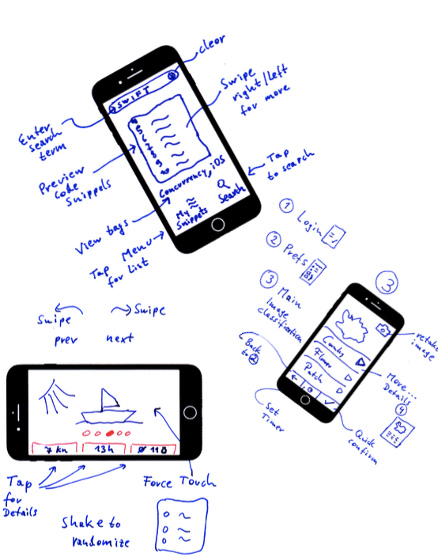
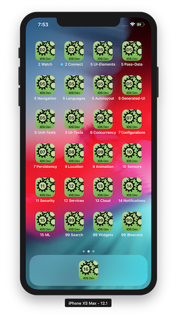

# iOS Development

A practical approach to create iOS apps.

> "Simplicity is the ultimate sophistication." — Leonardo da Vinci

## How to start

The very first step should be **paper prototyping**. Download [the template](./pdf/ux-design-templates.pdf), then scetch your main screen. Annotate the paper prototype with information about possible user interactions. Use *real* data for text, images and symbols, as shown in [this example](./pdf/ux-design-demos.pdf). Discuss the user interface with users of your target group.

> "We must design for the way people behave, not for how we would wish them to behave." — Donald A. Norman

## TL'DR: Mini Apps are included!

This repository includes many working [mini apps](demo-apps.md). 

 

The Apps linked are SwiftUI apps, many more older Storyboard Apps are available also.

## Compact Know-How Collection

First check out the [Study Material](./study-material--overview.md), then it is easy to answer the [Possible Exam Questions](study-material--part-X-Possible-exam-questions.md).

---
#### *This is the README.md of <https://git-iit.fh-joanneum.at/omd/ios-devel>.*

---