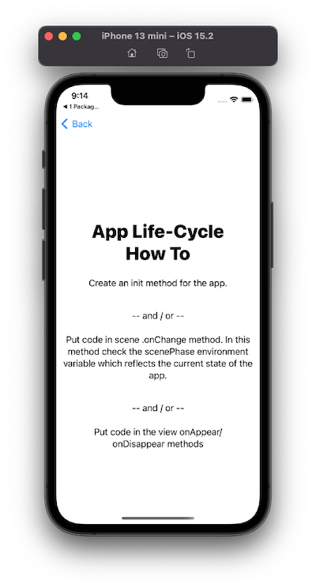

---

---
##### [Home](../../README.md) | [Up](../README.md)  | [Overview-Mini-apps](../../demo-apps.md)

---

## Life Cycle Events

In Section Demo Projects for Chapter 1 Intro 

An app can be in several states according to its life cycle:

* inactive
* active
* background

When an app enters a different state, an event is triggered. For example,
put code into `.onAppear(){...` and `.onDisappear(){...` callback / code block of a view.

For example, stop activities when the app looses focus (and other apps come in the forground).

[Open the project](./omd-ios-devel-chapter-01-AppLifeCycle.xcodeproj).