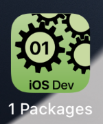
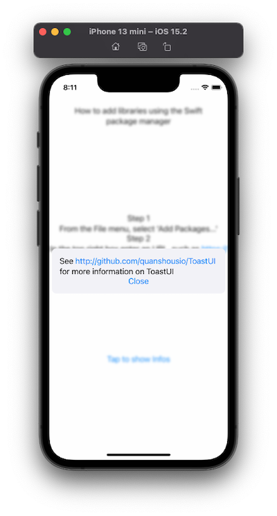
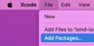
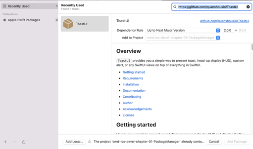

---

---
##### [Home](../../README.md) | [Up](../README.md)  | [Overview-Mini-apps](../../demo-apps.md)

---


## Package Manager 

 
   Demo Projects for Chapter 1 Intro. 

After adding a library for *Toast-Messages* via **Package Manager**, a beautiful toast message can be shown.



### Example Add ToastUI Package to your project

* Step 1: From the *File* menu, select *Add Packages...*

	

	


* Step 2: In the top right box enter an URL, such as <https://github.com/quanshousio/ToastUI> ToastUI to add the package.


* First **import** and use the package, e.g.: `import ToastUI`

```swift
import ToastUI
```

then use `.toast(isPresented: ...){ ... }`:

```swift
// ...
State private var presentingToast: Bool = false

// ...

Button {
    presentingToast = true
} label: {
    Text("Tap to read the message")
}.toast(isPresented: $presentingToast) {
    ToastView {
        VStack{
            Text("You lost your keys at the train station.")
            Button {
                presentingToast = false
            } label: {
                Text("Close")
            }
        }
    }
}
```

[Open the project](./omd-ios-devel-chapter-01-PackageManager.xcodeproj).


Find details on <http://github.com/quanshousio/ToastUI>.