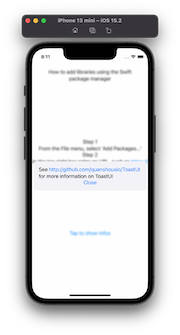
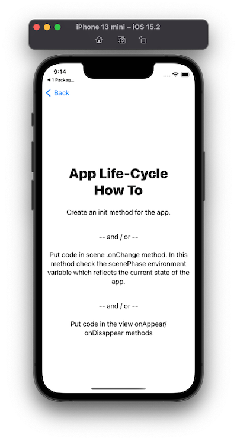
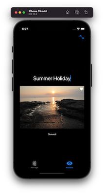

---

---
##### [Home](../README.md) | [Overview-Mini-apps](../demo-apps.md)

---

## 1 Intro 

Demo Projects for Chapter 1.

* [Package Manager](./PackageManager/README.md)
* [Life-Cycle](./AppLifeCycle/README.md)

### Preview (to many aspects of upcoming lectures)

* [Slideshow App](./SlideShowApp/README.md) Structure Model/Service/UI, Navigation, Databinding, Tap-Gesture
* [Slideshow App Refactoring](./SlideShowApp-Refactoring/README.md) Refactor Code, Add user-Interaction, Swipe Gestures, Animation, Fullscreen
* [Slideshow App Refactoring2](./SlideShowApp-Refactoring2-FetchFromWebService/README.md) Fetch Data from WebService

### Preview

| Demo-App  | Minimal Implementation of |  |
|:---------------| -------------|----| 
|  [Package Manager](./PackageManager/README.md)  |        Using Swift Packages | 
|  [Life-Cycle](./AppLifeCycle/README.md) | React on life-cycle events, e.g. stop activities when the app is inactive. | 
|  [SlideShow](./SlideShowApp/README.md) + [Refactoring](./SlideShowApp-Refactoring/README.md) + [Refactoring2](./SlideShowApp-Refactoring2-FetchFromWebService/README.md) | **Step-by-step** creating an app: start with model, add service, inject objects into the environment, use two-way data binding. Then **Refactor** by extracting views. Again **Refactor** (2) to fetch data from a web service.  | |

### Some minimal playground demos

* Poor Man's [Debugging with Print](PoorMansDebugging.playground) and `dump`.

---
#### Proceed to [Chapter 02 Testing](../chapter-02-testing/README.md) 

---