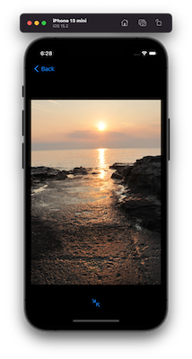
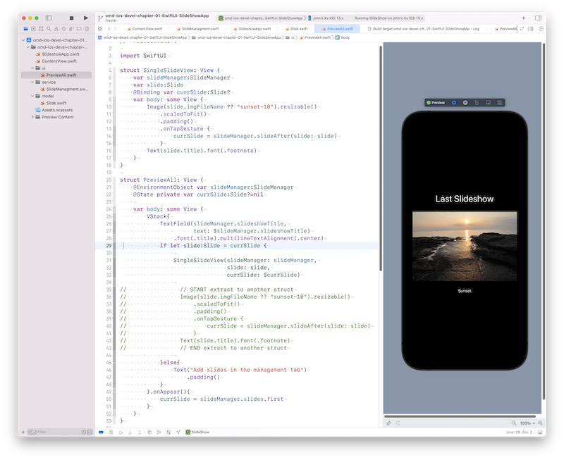
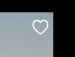
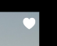
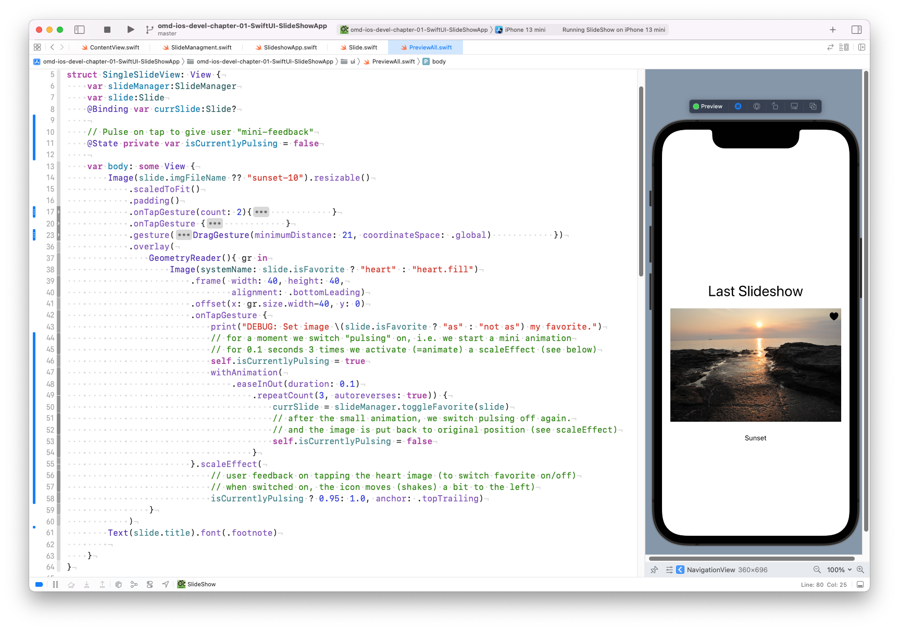
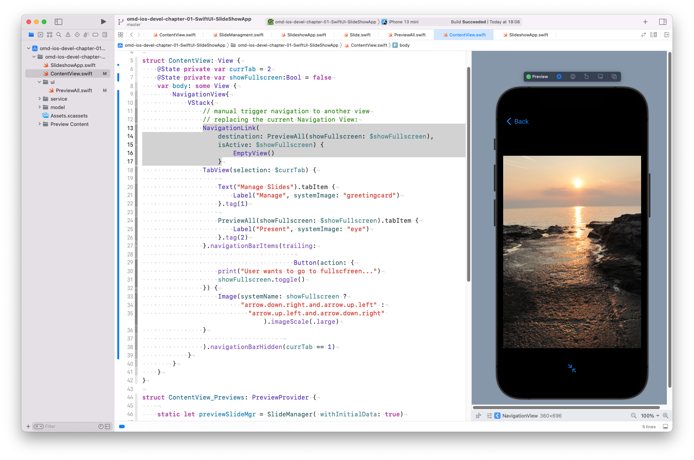

---

---
#### [Home](../../README.md) | [Up](../README.md)
---

In Section Demo Projects for Chapter 1 Intro 


## Slideshow App Refactoring


A preview to an app you might create at the end of the workshop.

For Setup the initial version see [README.md](../SlideShowApp/README.md) or original app.

# Refactoring 


 


### Step 10 Add another field 

We add a field to mark a slide as *favorite* and we add (editable) description for each slide. This will later allow us to tag a slide as favorite and to edit the description of each slide.


E.g. `description` and `isFavorite`) to the `slide` model. 

```swift
//  Slide.swift
struct Slide:Equatable, Identifiable {
    let id:UUID = UUID()
    var title:String
    var imgFileName:String? = nil
    var description:String? = nil
    var isFavorite:Bool = false
}
```


### Step 11 Refactoring - Extract UI 

To prevent long methods which are hard to read (and comprehend) we find out which lines of code are suitable to be extracted into a separate view.

*Hint:* Use COMMAND-CLICK on a View-Object in the code (or in the preview to get popup menu with option **Extract Subview** to extract into own struct. 

```swift
//  PreView.swift
...
            if let slide:Slide = currSlide {
                
                SingleSlideView(slideManager: slideManager,
                                slide: slide,
                                currSlide: $currSlide)
                
//                // START extract to another struct
//                Image(slide.imgFileName ?? "sunset-10").resizable()
//                    .scaledToFit()
//                    .padding()
//                    .onTapGesture {
//                        currSlide = slideManager.slideAfter(slide: slide)
//                    }
//                Text(slide.title).font(.footnote)
//                // END extract to another struct
                
            }else{

...
```

When extracting into a new view, we call/renamt the struct for example  **SingleSlideView**. This view is constructed by passing copies of a slide and of a slide manager. Additionally, we add **@Binding var currSlide:Slide?** which binds the variable `currSlide`, i.e. this variable will be updated in the parent view on change. The parent view will be upated on changes of `currSlide`, which in turn modifies `slide`, which forces an update of the SingleSlideView instance:

```swift
struct SingleSlideView: View {
    var slideManager:SlideManager
    var slide:Slide
    
    @Binding var currSlide:Slide?
    
    var body: some View {
        Image(slide.imgFileName ?? "sunset-10").resizable()
            .scaledToFit()
            .padding()
            .onTapGesture {
                currSlide = slideManager.slideAfter(slide: slide)
            }
        Text(slide.title).font(.footnote)
    }
}
```




### Step 12 Add interactive ♡ icon 

Add an element UI-element (over the image) with can trigger changes in the data. Here: we toggle **isFavorite** on tap for each slide.

 


Allow to tag/untag slide as favorite (show image) using an **Overlay** (or Zstack)

```swift
//  SlideManagment.swift

import Foundation
class SlideManager :ObservableObject {
	...
   func toggleFavorite(_ slide:Slide)->Slide{
        guard var modSlide = self.slides.first(where: {$0.id == slide.id} )else { return slide }
        print("DEBUG: Update slide \(modSlide) within the slides: \(slides)")
        
        // Note: You Can NOT MODIFY structs within a list with (because s is a copy, NOT a REFERENCE):
        modSlide.isFavorite = !modSlide.isFavorite
        // You have to update the proper slide WITHIN the collection!
        updateSlideInCollection(with: modSlide)
        print("DEBUG:                to: \(slides)")
        return modSlide
    }
    func updateSlideInCollection(with slide :Slide){
        slides.indices.filter { slides[$0].id == slide.id }.forEach { slides[$0].isFavorite = slide.isFavorite }
    }
    ...
```

Overlay the image and change internal value on tap.

```swift
//  PreView.swift

import SwiftUI
	...
        Image(slide.imgFileName ?? "sunset-10").resizable()
            ...
            .overlay(
                GeometryReader(){ gr in
                    Image(systemName: slide.isFavorite ? "heart" : "heart.fill")
                        .frame( width: 40, height: 40,
                                alignment: .bottomLeading)
                        .offset(x: gr.size.width-40, y: 0)
                        .onTapGesture {
                            print("DEBUG: Set image \(slide.isFavorite ? "as" : "not as") my favorite.")
                            currSlide = slideManager.toggleFavorite(slide)
                        }
                }
            )
    ...
```


### Step 13 Interaction with a Swipe Gesture


Allow to swipe left or right to change to next image.

```swift
//  PreView.swift

import SwiftUI
	...
        Image(slide.imgFileName ?? "sunset-10").resizable()
			  ....
			  .gesture(DragGesture(minimumDistance: 21, coordinateSpace: .global)
                        .onEnded { value in
                            let deltaX = value.translation.width as CGFloat
                            let deltaY = value.translation.height as CGFloat

                            if abs(deltaX) > abs(deltaY) {
                                print("Swipe \(deltaX < 0 ? "left" : "right") ")
                                currSlide = slideManager.slideAfter(slide: slide)
                            } else {
                                print("Swipe \(deltaY < 0 ? "up" : "down") ")
                            }
                        })
    ...
```


### Step 14 User Feedback with Animation

To optimise user feedback, we let the *heart*-image pulse on user interaction. I.e it pulses when the **user tags or untags** the current  slide as favorite slide. 


```swift
//  PreView.swift
struct SingleSlideView: View {
   var slideManager:SlideManager
	...
   // Pulse on tap to give user "mini-feedback"
   @State private var isCurrentlyPulsing = false
   
   var body: some View {
        Image(slide.imgFileName ?? "sunset-10").resizable()
            .scaledToFit()
            ...
             })
            .overlay(
						...
                    Image(systemName: slide.isFavorite ? "heart" : "heart.fill")
							...
                        .onTapGesture {
                            print("DEBUG: Set image \(slide.isFavorite ? "as" : "not as") my favorite.")
                            // for a moment we switch "pulsing" on, i.e. we start a mini animation
                            // for 0.1 seconds 3 times we activate (=animate) a scaleEffect (see below)
                            self.isCurrentlyPulsing = true
                            withAnimation(
                                .easeInOut(duration: 0.1)
                                    .repeatCount(3, autoreverses: true)) {
                                        currSlide = slideManager.toggleFavorite(slide)
                                        // after the small animation, we switch pulsing off again.
                                        // and the image is put back to original position (see scaleEffect)
                                        self.isCurrentlyPulsing = false
                                    }
                        }.scaleEffect(
                            // user feedback on tapping the heart image (to switch favorite on/off)
                            // when switched on, the icon moves (shakes) a bit to the left)
                            isCurrentlyPulsing ? 0.95: 1.0, anchor: .topTrailing)
                }
            ) 
  		...  
      
```




**Explanations:**  When changing the *Favorite*-status with an tap on the small upper right *heart*-image an animation should be triggered. This is done by changing the size of the image (`.scaleEffect(...)`) when user taps. On user tap, the flag `isCurrentlyPulsing` switches from false to true and triggers size changes of the image.  For any (size) change of the image, an (3-times) **repeated** (and **autoreversed**) animation is prepared. At the end of the animation, i.e. after the duration of 0.1 seconds, the flag `isCurrentlyPulsing ` is set back to its original state of *false*. 


### Step 15 Add fullscreen preview functionality


Navigate to detail view (i.e. view without tabs) on click on navigation bar icon. The navigation bar icon changes accordingly. How to switch fullscreen on and off by double clicking the image is shown further down.

```swift
//  ContentView.swift
...
struct ContentView: View {
	...
    @State private var showFullscreen:Bool = false
    var body: some View {
        NavigationView{
            VStack{
                // manual trigger navigation to another view
                // replacing the current Navigation View:
                NavigationLink(
                    destination: PreviewAll(showFullscreen: $showFullscreen),
                    isActive: $showFullscreen) {
                        EmptyView()
                    }
                TabView(selection: $currTab) {
                		....	
                	}.navigationBarItems(trailing: Button(action: {
                    print("User wants to go to fullscreen...")
                    showFullscreen.toggle()
                }) {
                    Image(systemName: showFullscreen ?
                          "arrow.down.right.and.arrow.up.left" :
                            "arrow.up.left.and.arrow.down.right" ).imageScale(.large)
                }
                                     
                ).navigationBarHidden(currTab == 1)
                		
```


For avoiding code duplication: within a view we might customise the appearance dependent on the fullscreen status, such as showing or hiding selected text.


```swift
//  PreView.swift
...
struct PreviewAll: View {
	...
    @Binding var showFullscreen:Bool
    var body: some View {
        VStack{
            if !showFullscreen {
                TextField(slideManager.slideshowTitle,
                          text: $slideManager.slideshowTitle)
                    .font(.title).multilineTextAlignment(.center)
                
            }
				....

```

In the same way, we customise the nested view (i.e. show alternative views, if full screen is switched on or off). On **doubleTapping** the image we allow to switch fullscreen on or off.

```swift
...
struct SingleSlideView: View {
	...
	@Binding var showFullscreen:Bool
	...
	var body: some View {
        Image(slide.imgFileName ?? "sunset-10")
        	.resizable()
        	.onTapGesture(count: 2){
                print("Double-tap togglea fullscreen... ")
                showFullscreen.toggle()
           }
           ...
 		...
       if showFullscreen{
            Button(action: {
                print("User wants to view full screen...")
                showFullscreen.toggle()
            }) {
                Image(systemName: showFullscreen ? "arrow.down.right.and.arrow.up.left" : "arrow.up.left.and.arrow.down.right" ).imageScale(.large)
            }.padding()
       }else{
            Text(slide.title).font(.footnote)
       }
   }
}
```





[Open the project](./omd-ios-devel-chapter-01-SwiftUI-SlideShowApp.xcodeproj).

---
#### Go on to [Refactoring2 Fetch Data from WebService](../SlideShowApp-Refactoring2-FetchFromWebService/README.md), or go back to [Slideshow App](../SlideShowApp/README.md).

---