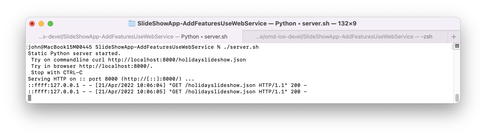
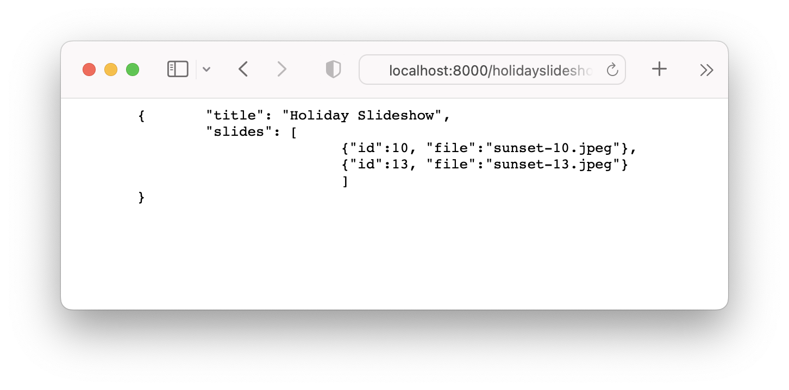
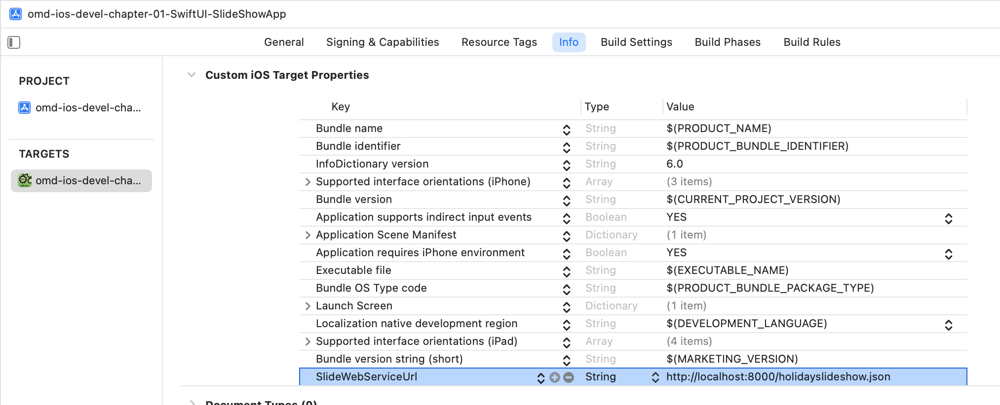

---

---
#### [Home](../../README.md) | [Up](../README.md)
---

In Section Demo Projects for Chapter 1 Intro 


## Slideshow App Refactoring2 Fetch Data from Web Service


A preview to an app you might create at the end of the workshop.


This is Step 3 Adding Features: Web Service

For Step1 Setup the initial version see [README.md](../SlideShowApp/README.md) or original app.

For Step2 Refactoring the initial version see [README.md](../SlideShowApp-Refactoring/README.md) or original app.


# Adding Features

## Consuming a Web Service

### Prepare WebService (with demo data)


* put (json-)data (`holidayslideshow.json`) into a new sub directory `ws-static-demo-data`:

	```bash
	mkdir -p ws-static-demo-data
	```

	```bash
	cat <<EOF > ws-static-demo-data/holidayslideshow.json
	{ 	"title": "Holiday Slideshow", 
		"slides": [
		           {"id":10, "file":"sunset-10.jpeg"},
		           {"id":13, "file":"sunset-13.jpeg"}
		          ]
	}
EOF
	```
	
* add images, such as `sunset-10.jpeg` and `sunset-13.jpeg` into subdir `ws-static-demo-data` 

* Check your data. 
	
	```bash
	cat ws-static-demo-data/holidayslideshow.json |json_pp

	tree ws-static-demo-data 
	ws-static-demo-data
	├── holidayslideshow.json
	├── sunset-10.jpeg
	└── sunset-13.jpeg
	```
 
 	And add some more demo data if you like.


* prepare and run a local server:

	* create server script:

	```bash
	cat <<-EOF > server.sh
	#!/bin/bash
	echo "Static Python server started."
	echo " Try on commandline curl http://localhost:8000/holidayslideshow.json"
	echo " Try in browser http://localhost:8000/."
	echo " Stop with CTRL-C"
	/usr/bin/env python3 -m http.server  --directory ./ws-static-demo-data 8000
	EOF	
	```
	
	* and make the script executable
	
	```bash
	chmod +x server.sh
	```
	

	* run server (which serves data on port 8000):

	
	 ```./server.sh```
	 
	 
	 


	* test on the commandline:

		```bash
		curl http://localhost:8000/holidayslideshow.json|json_pp
		...
		{
		   "slides" : [
		      {
		         "file" : "sunset-10.jpeg",
		         "id" : 10
		      },
		      {
		         "file" : "sunset-13.jpeg",
		         "id" : 13
		      }
		   ],
		   "title" : "Holiday Slideshow"
		}
		```


* Try in Browser

	```
	http://localhost:8000/
	```

	


### Create / Update your model(s)

* Create File `model/Slideshow` 

	```swift
	struct Slideshow:Decodable {
	    var title:String
	    var slides:[Slide]
	}
	```

* Update File `model/Slide` to conform to `Codeable` protocol:


	```swift
	struct Slide:Equatable, Identifiable {
	    let id:UUID = UUID()
	    var title:String
	    var imgFileName:String? = nil
	    var description:String? = nil
	    var isFavorite:Bool = false
	}
	extension Slide:Codable{
	    enum CodingKeys: String, CodingKey {
	        case id
	        case title
	        case description
	        case isFavorite
	        // We map JSON property 'file'
	        case imgFileName = "file"
	    }
	}
	``` 


### Prepare async loading functionality 

We provide an URL to be used in the Property List file `Info.plist`, because we do not like hard-coded strings!

 


Try right click on file `Info.plist` and *Open As / Source Code* to inspect the raw XML:

```xml
<?xml version="1.0" encoding="UTF-8"?>
<!DOCTYPE plist PUBLIC "-//Apple//DTD PLIST 1.0//EN" "http://www.apple.com/DTDs/PropertyList-1.0.dtd">
<plist version="1.0">
<dict>
	<key>SlideWebServiceUrl</key>
	<string>http://localhost:8000/holidayslideshow.json</string>
	
	<key>ImageBaseUrl</key>
	<string>http://localhost:8000/</string>
</dict>
</plist>
```

*Note: http is only valid for testing at localhost, otherwise https required!*


We are prepared for errors when using network, so we create file `model/CustomWSError` and invent some speaking error cases for possible problems:

```swift
enum WebServiceError: Error {
    case noUrlDefinedInInfoPropertyList
    case invalidURL
    case unexpectedStatusCode
    case slideshowDataDecodingError
}
```

For example, as method within the `SlideManager`:

* Step-by-step:
	* prepare URL (from string) to prepare a request (from url)
	* fetch data: `URLSession.shared.data` and check response
	* decode JSON

```swift
// provide async functionality to fetch data from web service endpoint
extension SlideManager {
    func fetchListOfSlidesFromWebService() async throws -> [Slide] {
        
        // URL
        guard let slideshowUrlString = Bundle.main.object(forInfoDictionaryKey: "SlideWebServiceUrl") as? String else {
            print("Err. Please provide the url string in the Info.plist as 'SlideWebServiceUrl'.")
            throw WebServiceError.noUrlDefinedInInfoPropertyList
        }
        
        guard let slideshowUrl = URL(string: slideshowUrlString) else {
            throw WebServiceError.invalidURL
        }
        print("Loding from \(slideshowUrl)...")
        
        
        // FETCH DATA
        let wsRequest = URLRequest(url:slideshowUrl)
        let (data, response) = try await URLSession.shared.data(for: wsRequest)
        print(" We got some raw data from the web service: '\(data.debugDescription)' ")
        
        guard (response as? HTTPURLResponse)?.statusCode == 200 else {throw WebServiceError.unexpectedStatusCode }

        print(" Data as string: '\(String.init(data: data, encoding: .utf8) ?? "Sorry, we cannot show data as UTF-8 string")' ")

        // DECODE JSON
        let decoder = JSONDecoder()
                
        guard let fetchedSlideshow =
                try? decoder.decode(
                        Slideshow.self, from: data) else {
                print("ERROR Decoding given data as valid Slideshow data. Check the JSON structure and try again.")
                throw WebServiceError.slideshowDataDecodingError
        }
        print("We fetched slideshow: '\(fetchedSlideshow)'")
        return fetchedSlideshow.slides
    }
}
```


### Finally, load async data from remote webservice

In your service trigger asynchronous loading of data from a web service:

```swift
class SlideManager{
  // ...
  @Published var slides:[Slide] = []
  // ...
  init(...){
    // ...
	Task {
	  let listOfSlides = try? await self.fetchListOfSlidesFromWebService()
	  if let listOfSlides = listOfSlides {
	    slides.append( contentsOf: listOfSlides)
	  }
	}
	// ...
  }
  // ... 
}
```

### View the list of slides

View list of slides in the management view

Prepare a new view, e.g. in file `ui/ManageListOfSlidesView.swift`

```swift
struct ManageListOfSlidesView: View {
    
    @EnvironmentObject var slideManager:SlideManager
    
    var body: some View {
        List(slideManager.slides) { slide in
            Text(slide.title)
        }
    }
}
```

Update the `ContentView` in file `ContentView.swift` to use the new created list of slides from above:

```swift
struct ContentView: View {
//..
 TabView(selection: $currTab) {
   ManageListOfSlidesView().tabItem {
   // Text("Manage Slides").tabItem {
     Label("Manage", systemImage: "greetingcard")
   }.tag(1)
   
   PreviewAll( // ...
 //...
}
```


### Loading images on demand

Prepare functionality to fetch raw image data from the server.

```swift
struct Slide:Equatable, Identifiable {
    let id:UUID = UUID()
    var title:String
    var imgFileName:String? = nil
    var description:String? = nil
    var isFavorite:Bool = false
    
    // a property, which loads image data in the background on demand:
    var uiImageFromCacheOrWebservice:UIImage?  {
        get async throws{
            // exit function if no image name given. Nothing to do.
            guard let imgFileName = imgFileName else { return nil }
            
            
            // TODO Check CACHE .. (see below)
            
            // URL + REQUEST
            guard let webserviceBaseUrlString = Bundle.main.object(forInfoDictionaryKey: "ImageBaseUrl") as? String else {
                print("Err. Please provide the url string in the Info.plist as 'ImageBaseUrl'.")
                throw WebServiceError.noUrlDefinedInInfoPropertyList
            }
            let req = URLRequest(
                  url: URL(string: "\(webserviceBaseUrlString)/\(imgFileName).jpeg")!)
            print("DEBUG: Loading '\(String(describing: req.url))'")
            
            
            // FETCH
            let (data,res) =
                      try await URLSession.shared.data(for: req)
            guard (res as? HTTPURLResponse)?.statusCode == 200 else{
                print("ERR: could not fetch image from '\(String(describing: req.url))'.")
                throw WebServiceError.unexpectedStatusCode
            }
            
            // Network DELAY
            // just for fun (0.5 secs. delay)...
            print(" Simulating some network time overhead")
            try? await Task.sleep(nanoseconds: 500 * 1_000_000)
            
            
            // IMAGE (from data)
            print("We create an image from the data (\(data)) received.")
            let resultingUIimage = UIImage(data: data)
            
            // TODO Update CACHE .. (see below)
            
            return resultingUIimage
        }
    }
}

```


Trigger loading images if viewing first / another slide:

```swift
struct SingleSlideView: View {
	// ...
	@State var currSlide:Slide
	// ...
	let placeholder = UIImage(systemName: "photo")!    // ! ...  we are we 100% sure the placeholder exists
	let loadingImg = UIImage(systemName: "timelapse")! // display loading image ... check out "SF Symbols"
	@State private var uiimg:UIImage?
	var body: some View {
		// ...
		 Image.init(uiImage: uiimg ?? placeholder)
	        .resizable()
	        .onChange(of: currSlide) {s in
	            uiimg = loadingImg
	            Task {
	               uiimg = try? await currSlide.uiImageFromCacheOrWebservice
	            }
	        }
	        .task { // Once, when view appears
	            uiimg = try? await currSlide.uiImageFromCacheOrWebservice
	        }
		//...	
	}
}
```


### Caching

We should load the images dynamically on demand. We use caching for loading images only once.

An instance of the new class `ImageCache` (Note: singleton pattern) can be used to cache some images. We use Swift *operator overloading* of ```[]``` for accesing the cached values. Use ```ImageCache.shared[ k ] = v``` to add an image to the cache and ```v = ImageCache.shared[ k ]``` to retrieve an image from the cache (if available).
 
```swift
class ImageCache {
    private var cachedImages:[String:UIImage] = [:]
    private init(){}
    public static let shared:ImageCache = ImageCache()

    subscript(_ key:String) -> UIImage? {
        get {
           return cachedImages[key]
        }
        set (anotherUIImg){
            // TODO: Optionally, limit cache to maximal 10 elements or so
            cachedImages[key] = anotherUIImg
        }
    }
}
```


We modify the Slide to use cache images if available instead of fetching from the web service. 


```swift
struct Slide:Equatable, Identifiable {
	// ...
    var imgFileName:String? = nil
	// ...
    var uiImageFromCacheOrWebservice:UIImage?  {
        get async throws{
            guard let imgFileName = imgFileName else { return nil }
            
            let uiImageCached = ImageCache.shared[imgFileName]
            guard uiImageCached == nil else {
                return uiImageCached
            }
 
            // ... 
            // fetch from web service 
            // ...
 			             
            let resultingUIimage = UIImage(data: data)
            ImageCache.shared[imgFileName] = resultingUIimage
            return resultingUIimage
        }
    }
}

```


With caching the performance is much better (although we might need additional memory for the cache).


[Open the project](./omd-ios-devel-chapter-01-SwiftUI-SlideShowApp.xcodeproj).

---
#### Back to [Slideshow App Refactoring](../SlideShowApp-Refactoring/README.md).

---