---

---
#### [Home](../../README.md) | [Up](../README.md)

---

## Slideshow App

In Section Demo Projects for Chapter 1 Intro 


A preview to an app you might create at the end of the workshop:

### Preperations

* Step 1 Add [demo sunset](prepared-image-data) images into the assets.

* Update AppIcon (e.g. remove existing app icon and add [AppIcon (AppIcon.appiconset)](../../../export/export_app-icons/chapter-01/iOS/) to the assets.

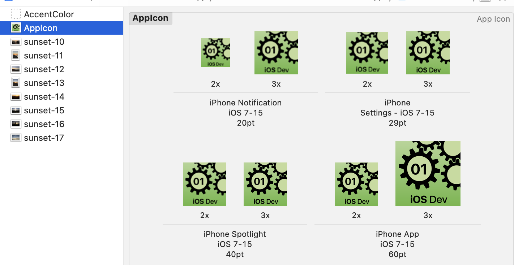

* Step 2 Rename main Swift file for App to **SlidehowApp*

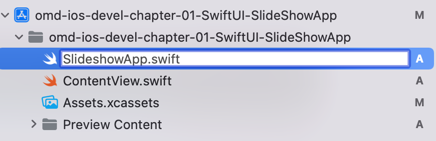
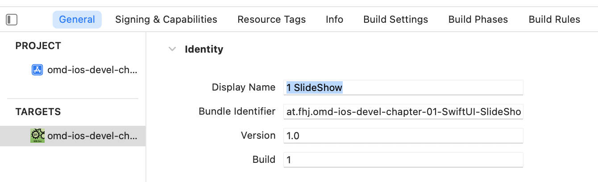

## Implementation

Implement *Model/Viev/Controller*-like `structs` and `classes` and SwiftUI interfaces in subfolders accordingly.

### Step 3 Model

Add a struct as model which can be managed by collections.

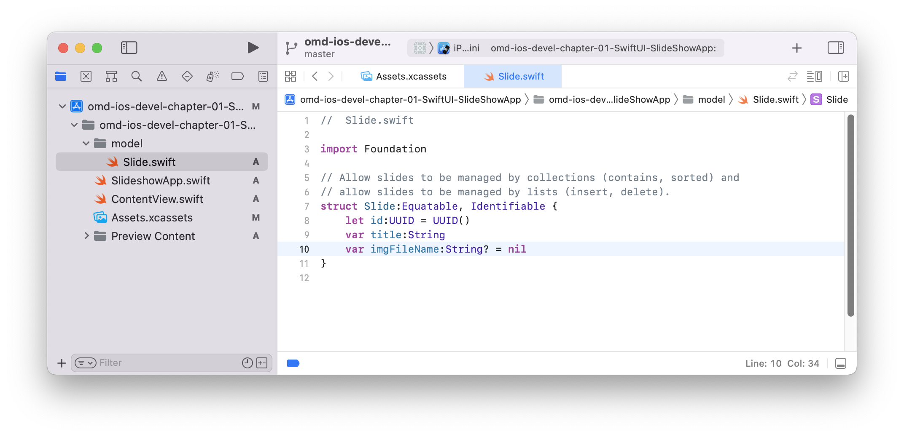


```swift
struct Slide:Equatable, Identifiable {
    let id:UUID = UUID()
    var title:String
    var imgFileName:String? = nil
}
```


### Step 4 Service

Add a class as (singleton) service (create by `sharedInstance`) which can be manage a collection of slides.


```swift
class SlideManager {
    var slides:[Slide] = []
    
    private init(){}
    static let sharedInstance = SlideManager()
	
    func seedWithDemoData(){
        self.slides.append(contentsOf: [
            Slide(title: "Sunset",
                  imgFileName: "sunset-10"),
            Slide(title: "At the beach",
                  imgFileName: "sunset-11"),
            Slide(title: "Water",
                  imgFileName: "sunset-12"),
            Slide(title: "Sand & Water",
                  imgFileName: "sunset-13")
        ])
    }
}
```


### Step 5 User Interface

Prepare a new interface and preview in dark mode.

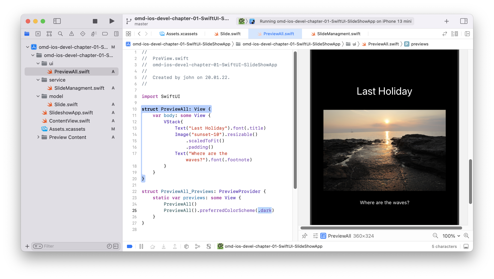

```swift
import SwiftUI

struct PreviewAll: View {
    var body: some View {
        VStack{
            Text("Last Holiday").font(.title)
            Image("sunset-10").resizable()
                .scaledToFit()
                .padding()
            Text("Where are the waves?").font(.footnote)
        }
    }
}

struct PreviewAll_Previews: PreviewProvider {
    static var previews: some View {
        PreviewAll()
        PreviewAll().preferredColorScheme(.dark)
    }
}
```

### Step 6 Navigation


Allow to show section *Manage* and section *Present* on different tabs. Use a local **@State** varialbe to reflect the current selected tab. 


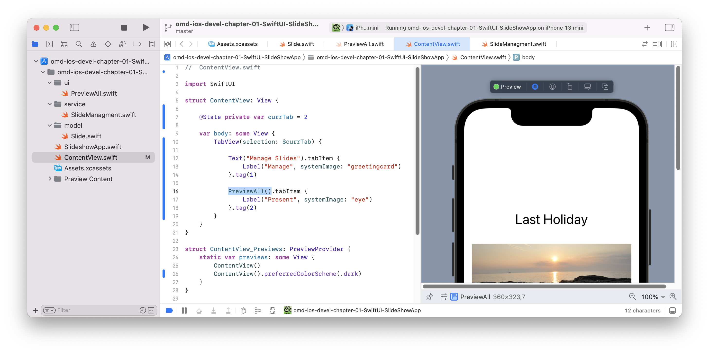

```swift
//  ContentView.swift

import SwiftUI

struct ContentView: View {
    
    @State private var currTab = 2
    
    var body: some View {
        TabView(selection: $currTab) {
            
            Text("Manage Slides").tabItem {
                Label("Manage", systemImage: "greetingcard")
            }.tag(1)
            
            PreviewAll().tabItem {
                Label("Present", systemImage: "eye")
            }.tag(2)
        }
    }
}

struct ContentView_Previews: PreviewProvider {
    static var previews: some View {
        ContentView()
        ContentView().preferredColorScheme(.dark)
    }
}
```

###  Step 7 Data Binding (UI - Service)

We allow to edit the title of slideshow. Modify your *service* to conform to protocol **:ObservableObject** with some **@Published** variables.


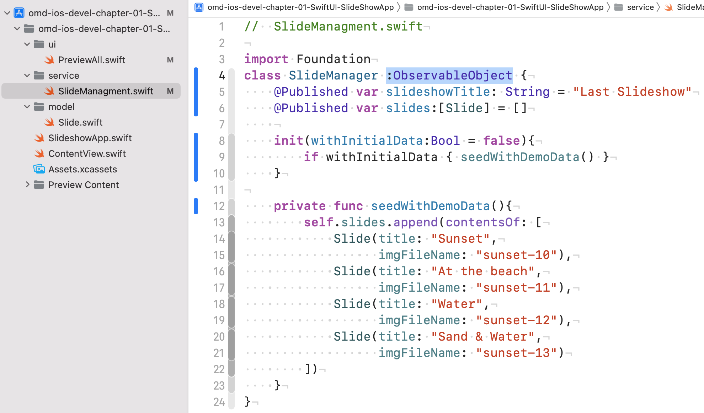

```swift
//  SlideManagment.swift
import Foundation
class SlideManager :ObservableObject {
    @Published var slideshowTitle: String = "Last Slideshow"
    @Published var slides:[Slide] = []
    
    init(withInitialData:Bool = false){
        if withInitialData { seedWithDemoData() }
    }
...
```


Create and **inject** an instance to view when starting the app, and another (with demo data) for the preview). It is a way of *Dependency Injection*.

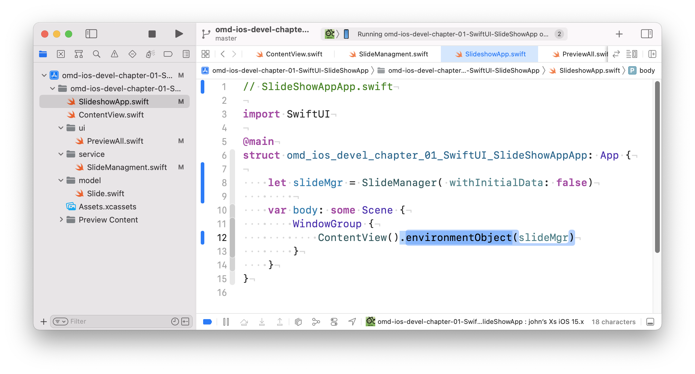


```swift
// SlideShowAppApp.swift
	
import SwiftUI
	
@main
struct omd_ios_devel_chapter_01_SwiftUI_SlideShowAppApp: App {
	
    let slideMgr = SlideManager( withInitialData: false)
        
    var body: some Scene {
        WindowGroup {
            ContentView().environmentObject(slideMgr)
        }
    }
}
```

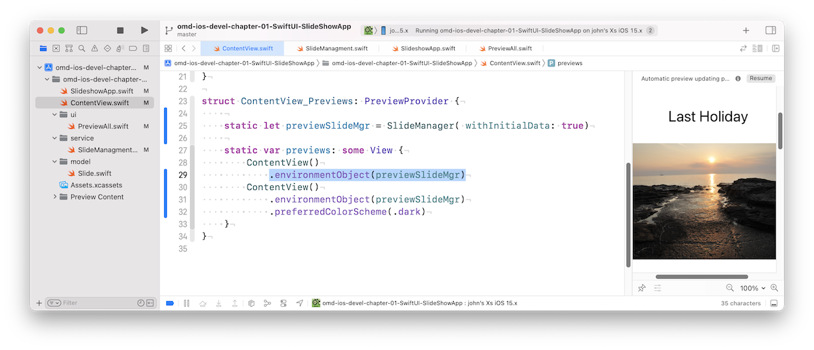

```swift
//  ContentView.swift
...
struct ContentView_Previews: PreviewProvider {
    
    static let previewSlideMgr = SlideManager( withInitialData: true)
    
    static var previews: some View {
        ContentView()
            .environmentObject(previewSlideMgr)
        ContentView()
            .environmentObject(previewSlideMgr)
            .preferredColorScheme(.dark)
    }
}
```


Use the data from the object within any of your views. E.g. define variables annotated as **@EnvironmentObject**.


```swift
//  PreView.swift
...
struct PreviewAll: View {
    
    @EnvironmentObject var slideManager:SlideManager
    
    @State private var currSlide:Slide?=nil
    
    var body: some View {
        VStack{
            Text(slideManager.slideshowTitle).font(.title)
            if let slide:Slide = currSlide {
                Image(slide.imgFileName ?? "sunset-10").resizable()
                    .scaledToFit()
                    .padding()
                Text(slide.title).font(.footnote)
            }else{
                Text("Add slides in the management tab")
                    .padding()
            }
        }.onAppear(){
            currSlide = slideManager.slides.first
        }
    }
}
```


### Step 8 Interaction with tap (gestures)

Add code to get next slide and to tap to present next slide

```swift
//  SlideManagment.swift
	
import Foundation
class SlideManager :ObservableObject {
	...
   func slideAfter(slide:Slide) -> Slide? {
        guard var currIdx:Int = self.slides.firstIndex(of: slide) else {
            return self.slides.first
        }
        currIdx += 1
        return slides.count < currIdx ? slides[currIdx] : self.slides.first
   }
}
```

Tap (i.e. **On Tap Gesture**) to display the next slide.

```
//  PreView.swift
...
    var body: some View {
	...
	    if let slide:Slide = currSlide {
	        Image(slide.imgFileName ?? "sunset-10").resizable()
	            .scaledToFit()
	            .padding()
	            .onTapGesture {
	                currSlide = slideManager.slideAfter(slide: slide)
	            }
...
```

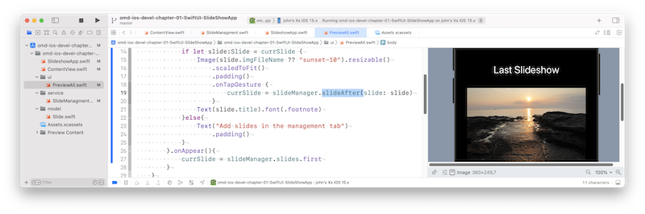


###  Step 9 Data Binding for the *Slideshow-Title*

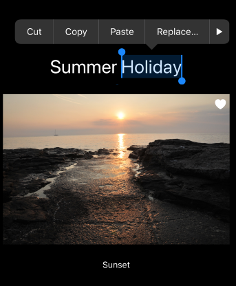


Edit the Slideshow title by using a **TextField** with a String binding variable **$slideManager.slideshowTitle** 

```swift
//  PreView.swift
...
struct PreviewAll: View {
    @EnvironmentObject var slideManager:SlideManager
	...
    var body: some View {
        VStack{
            TextField(slideManager.slideshowTitle,
                      text: $slideManager.slideshowTitle)
                .font(.title).multilineTextAlignment(.center)
```


For debugging, we log any changes happening in the ObservableObject in **didSet**.  

```swift
//  SlideManagment.swift
	
import Foundation
class SlideManager :ObservableObject {
    @Published var slideshowTitle: String = "Last Slideshow" {
        didSet {
            print("TODO: Persist the changed slideshow title '\(slideshowTitle)'.")
        }
    }
    ...
```

[Open the project](./omd-ios-devel-chapter-01-SwiftUI-SlideShowApp.xcodeproj).


---
#### Go on to [Refactoring the app](../SlideShowApp-Refactoring/README.md).

---