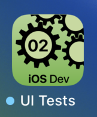

---

---
#### [Home](../../README.md) | [Up](../README.md)| [Overview-Mini-apps](../../demo-apps.md)

---


## UI Testing

In Demo Projects for Chapter 2 Testing 





To make UIs tesable, provide accessibiliy IDs for the view you want to interact with.

```swift
struct ContentView: View {
	var body: some View {
 		Slider(value: $selection,
                   in: 2...9,
                   step:1)
			.accessibilityIdentifier("favNumberSlider")
		// ...
```


An additional target for testing must be created. 

Classes inherit from ```XCTestCase``` and provide methods with names starting with ```test``` (e.g. ```func testSlidingToGivenPosition(){...}```). 


```swift
func testSlidingToGivenPosition() throws {
	// a "proxy" to the UI (elements), the views to manipulate.
	let app = XCUIApplication()
	app.launch()
	
	// for finding a view
	// the accessibility id must be set (e.g. favNumberSlider)
	let slider = app.sliders["favNumberSlider"]
	        
	// automate the interaction
	slider.swipeRight()
	
	// Check the result (location/setting) of slider:
    if let selectedVal = slider.value as? String{ 
    	  ...
        // Test the current state of the UI
        XCTAssertEqual(selectedVal, "8")
            
	// ...
}     
```

Open the [Project](./omd-ios-devel-chapter-02-UITesting.xcodeproj).
	
	
---
#### Proceed to [Chapter 03 Swift](../../chapter-03-swift/README.md) | Back to [Chapter 01 Intro](../../chapter-01-intro/README.md)


---