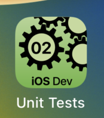

---

---
#### [Home](../../README.md) | [Up](../README.md)| [Overview-Mini-apps](../../demo-apps.md)

---


## UnitTesting

In Demo Projects for Chapter 2 Testing 




An additional target for testing must be created
and the code of the app (e.g. ```TheApp```) under test is imported ```@testable import TheApp```. 

Classes inherit from ```XCTestCase``` and provide methods with names starting with ```test``` (e.g. ```func testCreateRandomNumber(){...}```). 

Within the functions, expected values are checked with methods, such as ```XCTAssertEqual(...)```  ```XCTAssertNotNil(...)```, ```XCTAssertEqual(...)```.


Open the [Project](omd-ios-devel-chapter-02-UnitTesting.xcodeproj).
	
	
---
#### Proceed to [Chapter 03 Swift I (Basics)](../../chapter-03-swift-i/README.md) | Back to [Chapter 01 Intro](../../chapter-01-intro/README.md)


---