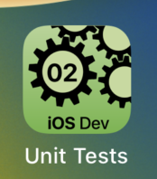
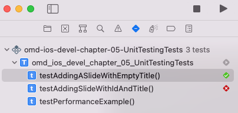
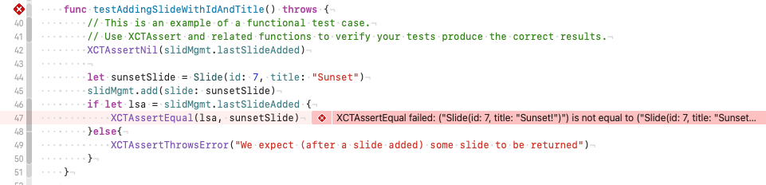
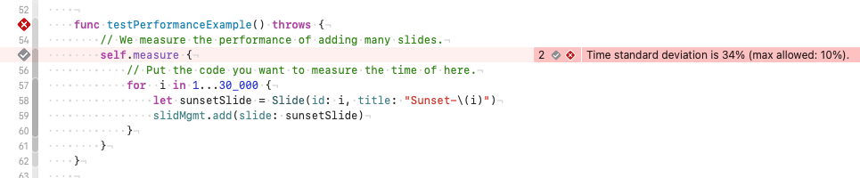

---

---
#### [Home](../../README.md) | [Up](../README.md) | [Overview-Mini-apps](../../demo-apps.md)

---

## Unit Tests with Performance Metering

Demo Projects for Chapter 2 Testing: Unit (and performance) testing.

## Run Tests in Xcode 

Startup all or single test cases

Check problems reported and repair code if necessary

Run first tests to set the baseline. Later, compare test case execution to the baseline (has anything slowed down because of your latest code changes?). 

[Open the project](./omd-ios-devel-chapter-05-UnitTesting.xcodeproj).
	
---
#### Proceed to [Chapter 03 Swift I (Basics)](../../chapter-03-swift-i/README.md) | Back to [Chapter 01 Intro](../../chapter-01-intro/README.md)

---