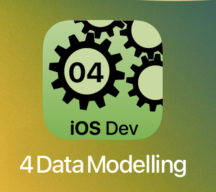

---

---
#### [Home](../../README.md) | [Up](../README.md) | [Overview-Mini-apps](../../demo-apps.md)

---


## Data Modelling

In Section Demo Projects for Chapter 4 Data Modelling.



Structure your app. For example,

* Prepare subdir for your model(s)
	* e.g. new **group** `model`

	* e.g. new Swift **file** `model/Slide.swift`

		```swift
		struct Slide{
		    var title:String
		    var imgFileName:String? = nil
		}
		```
	
		We need data to be **comparable** and **identifiable** to be presented on the user interface in lists etc. 

		```swift
		struct Slide:Equatable, Identifiable {
		    let id:UUID = UUID()
		    var title:String
		    var imgFileName:String? = nil
		}
		```

		* Optionally, (unit-)**test** creation of some data
			
			```swift
			final class omd_ios_devel_chapter_04_Data_ModellingTests: XCTestCase {
			....
				func testSlideCreation() throws {
					let sunsetSlide = Slide(title: "Sunset",
					              imgFileName: "sunset.png")
					print("The first slide \(sunsetSlide)")
					XCTAssert(sunsetSlide.title == "Sunset")
				}
			```

* Prepare service subdir
	* e.g. new  **group** `service`
	* e.g. new Swift **file** `service/SlideManagement.swift`


	```swift
	class SlideManager{
		var slides:[Slide] = []
		
		init(withInitialData:Bool = false){
        if withInitialData { seedWithDemoData() }
    }
    private func seedWithDemoData(){
        self.slides.append(contentsOf: [
            Slide(title: "Sunset",
                  imgFileName: "sunset-10"),
            Slide(title: "At the beach",
                  imgFileName: "sunset-11")])
    }
	}
	```
	
	* Optionally, test your logic

		```swift
		final class omd_ios_devel_chapter_04_Data_ModellingTests: XCTestCase {
		....
			func testSlideManager() throws {
			    let mgmt = SlideManager(withInitialData: true)
			    print("Some slides: \(mgmt.slides)")
			    XCTAssert(mgmt.slides.last?.title == "At the beach")
			}
		```
	

* Prepare UI subdir
	* e.g. `ui`
	* to visualise your data. For **data binding** and **UI widgets** to render current values of your variables and objects see next [Chapter 05 GUI](../../chapter-05-gui/README.md). 


[Open the project](./omd-ios-devel-chapter-04-Data-Modelling.xcodeproj).


---
#### Proceed to [Chapter 05 GUI](../../chapter-05-gui/README.md) | Back to [Chapter 03 Swift](../../chapter-03-swift/README.md)


---