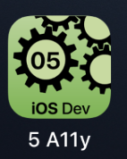

---

---
#### [Home](../../README.md) | [Up](../README.md) | [Overview-Mini-apps](../../demo-apps.md)

---


Demo Projects for Chapter 5 GUI 


## A11Y and UI-Testing

### Accessibility (A11y)




Support visually impaired people by adding hints for the screenreader.

For example, a slider needs text added, which allows the screenreader to speak the current slider position (`accessibilityValue`), as well as an expanatory text what the slider is used for (`accessibilityHint(`). A trait will give further information to visually impaired or blind pepole. For example with `accessibilityAddTraits` one can add multiple hints, such as if user input is possible.
 
 
* Example, of adding A11y information to a slider:

	```swift
	Slider(value: $selection)
	    .accessibilityHint("Select your favorite number by sliding to the left")
	    .accessibilityValue("\(selection)")
	    .accessibilityAddTraits(.allowsDirectInteraction)
	    .accessibilityIdentifier("favNumberSlider")
	```

### UI Testing

For UI testing, the unique identifier `.accessibilityIdentifier` is used to read or manipulate elements onscreen during test automation. 
	
* UI tests are created and exectuted within Xcode as an additional target within an app project. 
* they are executed by remote controlling the simulator 

	```swift
	import XCTest

	class myProject: XCTestCase {
		... 
		func testTheSliders() throws {
			...
			let app = XCUIApplication()
        	app.launch()
        	...
        	let slider = app.sliders["favNumberSlider"]
			slider.swipeRight()
			if let selectedVal = slider.value as? String{
				XCTAssertEqual(selectedVal, "0.8")
	```
	
	
[Open the project](./omd-ios-devel-chapter-05-SwiftUI-Accessibility.xcodeproj).


---
#### Proceed to [Tab Bar](../Tabs/README.md) | Back to [Widgets](../Widgets/README.md)

---