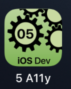

---

---
#### [Home](../../README.md) | [Up](../README.md)| [Overview-Mini-apps](../demo-apps.md)

---


## Data Binding

In Demo Projects for Chapter 5 GUI 





* Within a page

	`@State private var currTab = 1`

* Two-way data binding 

	In the base view, pass a reference when calling the detail view
	
	`DetailView($description)`
	
	In the detail view expect and accept a *binding* parameter

	```
	@Binding var description:String
	```
	
* Two way data binding and observable models.

	Prepare a class to be observable:
	
	```
	class ObserableSlideModel:ObservableObject {
	@Published var slideShowTitle:String = "The Holiday Slideshow"
	@Published var slides = [Slide].self()
    ...
	```	

	Update the model from the UI with observed objects:

	
	`@ObservedObject var observalbeSlideModel = ObserableSlideModel()`
	

* Environment / Injection:

	Optionally, inject instances of observable objects into the environment. E.g. in the main app when calling the first content view:

	```
	WindowGroup {
            MainView().environmentObject(NavigationHelper())
	```
	
	Use in a view
	
	```
	@EnvironmentObject var navigationHelper: NavigationHelper
	```
	
	
### Hints
	
* Optionally, you might be notified within the view when some data changes (e.g. a so called *Publisher* pushes changed data from - for example - a background service to the current view)

	```swift
	// Optionally, we (the view) might react on changes.
	//     Changes of data in the background service, i.e.
	//     changes pushed by a "Publisher" to the current view.
   .onReceive(observalbeSlideModel.$slides){ slds in
            print("DEBUG: Just for your info: slides \(slds) have changed...")
   }
	```


Open the [Project](omd-ios-devel-chapter-05-SwiftUI-DataBinding.xcodeproj).
	
	
---
#### Proceed to [Unit Testing](../UnitTesting/README.md) | Back to [Localisation](../Localisation/README.md)

---