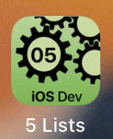

---

---
#### [Home](../../README.md) | [Up](../README.md) | [Overview-Mini-apps](../../demo-apps.md)

---


## SwiftUI - Layouts

In Section Demo Projects for Chapter 5 GUI.




The overall layout can be specified (arranged, grouped), for example, with different Stacks, with Spacers or by adding padding. Furthermore the **Safe Area** can be ignored to present information in **full screen** also.

```swift
ZStack{
    ...
}.ignoresSafeArea(
    .container,      // .keyboard
    edges: [.bottom] // region .top, .leading,...
    )
```
 	
	
[Open the project](./omd-ios-devel-chapter-05-SwiftUI-Layouts.xcodeproj).


---
#### Proceed to [Localisation](../Localisation/README.md) | Back to [Navigation](../Navigation/README.md)

---