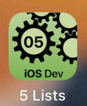

---

---
#### [Home](../../README.md) | [Up](../README.md) | [Overview-Mini-apps](../../demo-apps.md)

---


Demo Projects for Chapter 5 GUI 


## Lists




Provide scollable lists and tap to disclose the details.

* List or ForEach

	```swift
	List(slides) { slide in
	```
	
* Navigate to detail view

	```swift
	NavigationView{
	 ...
		List(theSlideShowManagement.slides) { slide in
   			NavigationLink(destination: SingleSlideView(slideID: slide.id)) {
            Text("\(slide.title)")
        	}
   		}
   	}
	```


* Allow refreshing of data (including user feedback)

```swift
List(viewModel.entries) { entry in
   ...
}.refreshable {
  // code to refresh data
	viewModel.refresh()
}

```
 
	
	
[Open the project](./omd-ios-devel-chapter-05-SwiftUI-Lists.xcodeproj).

	
---
#### Proceed to [Navigation](../Navigation/README.md) | Back to [Tabs](../Tabs/README.md)

---