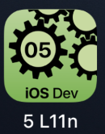
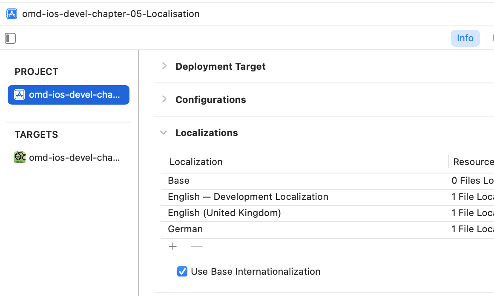
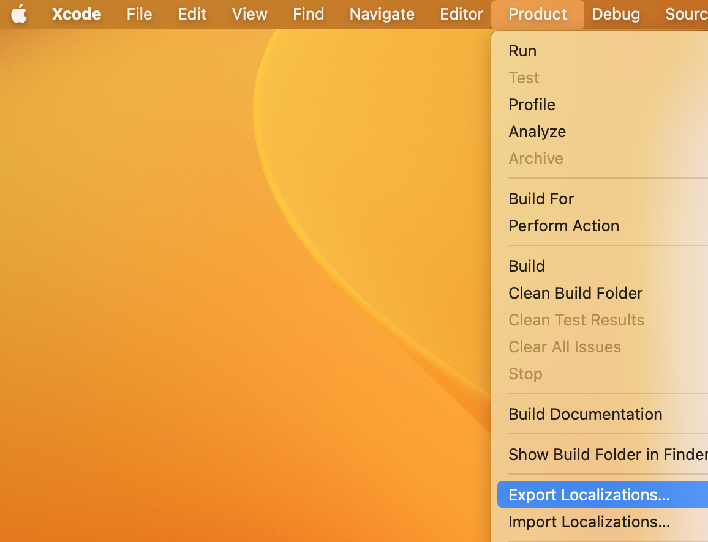

---

---
#### [Home](../../README.md) | [Up](../README.md) | [Overview-Mini-apps](../../demo-apps.md)

---


## Localisation (L10n)

In Section Demo Projects for Chapter 5 GUI 




L10n is short for *Localisation*. Translate to user interface to multiple languages.


 

Translations are provided as key value in `Localizable.strings` files in the file system. 

* file `de.lproj/Localizable.strings`:

	```
	"Enter the password" = "Bitte das Passwort eingeben";
	```

* file `en.lproj/Localizable.strings`:
	
	```
	"Enter the password" = "Enter the password";
	```

Any **non-dynamic** text is localised automatically in the user interface, in SwiftUI. 

```swift
Text("Enter the password")
```

For dynamic text or other locations (i.e. not within SwiftUI) you might force localisation lookup with:

```swift
NSLocalizedString("Enter the password", comment: "Enter the password to login.")
```

Preview your UI in multiple languages

```swift
ContentView().environment(\.locale, .init(identifier: "en-UK"))
```
	

Add more languages (see screenshot above), then export *localisable* strings (```Xcode/Menu/Product/Export Localizations...```), open the `*.xcloc` files, add translations and finally reimport again.


 
	
	
	
[Open the project](./omd-ios-devel-chapter-05-Localisation.xcodeproj).


---
#### Proceed to [Data Binding](../DataBinding/README.md) | Back to [Layouts](../Layouts/README.md)

---