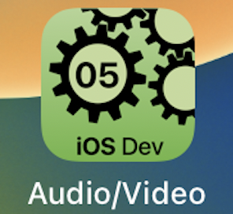
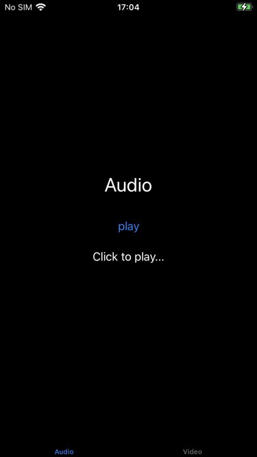
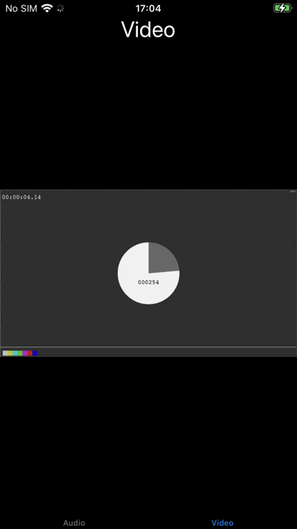

---

---
#### [Home](../../README.md) | [Up](../README.md) | [Overview-Mini-apps](../../demo-apps.md)

---

Demo Projects for Chapter 5 GUI 

## Multimedia: Audio + Video

* Demos Audio / Video

* Better stop playback when leaving the screen

*Note: video from <https://devstreaming-cdn.apple.com/videos/streaming/examples/bipbop_adv_example_hevc/master.m3u8>*
	
	
	
	
[Open the project](./Multimedia.xcodeproj).

	
---
#### Proceed to [Layouts](../Layouts/README.md) | Back to [Lists](../Lists/README.md)

---
   