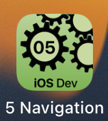

---

---
#### [Home](../../README.md) | [Up](../README.md) | [Overview-Mini-apps](../../demo-apps.md)

---


Demo Projects for Chapter 5 GUI 


## Navigation





*Normal* navigation is triggered bei user interaction, such as swipe gestures or button clicks.

Different way to *navigate* to other views:

* Switch *Tab*-Views
* Reveal *Detail*-Views
* Blend in *Overlays*-Sheets
* Show *Popups*-Alerts
	

Typically, to navigate to another view, we 

* **switch** between multiple *tabs* of a `TabView`,
	
	```swift
	  TabView(selection: $currTab) {
	       ...
	       About(currentTab: $currTab)
	          .tabItem { Text("Abot") }.tag(1)
		...
	```
                
                
* **replace** the (all or parts of) the current (nested tree of) nodes of) view(s) enclosed in a `NavigationView` with a new target *detail* view (specified as a `NavigationLink`-destination).

	```swift
	NavigationView{
		...
		NavigationLink("Tap me", destination: MyTargetView() )
		...
	}
	```


Additionally, *data-driven navigation* is possible. It is a **paradigm** where state changes will trigger navigation.

* We can **present** a view as *overlay* and *alert* with `.sheet(isPresented..)`,  `.alert(isPresented..)`. For example with ```isPresented``` of a sheet: 

	```
	.sheet(isPresented: $editMode){
	      DetailsView(loc: $home)
	 }
	```

	* Hint: the boolean variable (here '$editMode') is set to false if you dismiss the alert/overlay. 

		```swift
		// Optionally, check when 'editMode' changes in your view
     .onChange(of: editMode) { em in
     		print("FYI: status of variable editMode  changed to new value: '\(em)'. ")
     }
		```

 
A **Navigation Stack** allows to manage the **Navigation Path**. 

* Sophisticated (nested) navigation can be archived with `NavigationLink`s within a `NavigationStack`. These navigation stacks are used in combination with lists. 

	```swift
	 @State private var naviPath: [City] = []
	  ...
		NavigationStack(path: $naviPath){
			...
			ForEach(cities){ city in 
				...
				NavigationLink("tap me", value: city)
				...
			}.navigationDestination(...) { MyTargetView(city) }
			...
		}
	```

	Additionally, setting (or removing) several views programmatically on the **navigation path** is possible. 
	
	```swift
	naviPath = [...] 
	...
	naviPath.removeAll()
	```


	
Unless the **return**-navigation is presented automatically by the system, we can return from (detail) views 

* programmatically with `dismiss`:

	```swift
	@Environment(\.dismiss) var dismiss
	
	...
		
	dismiss()
	```
	
	
#### Further explanations (code in main 'app.swift' file)

An app starts in a struct annotated with `@main` and the struct conforms to protocol `App`. Inside the app you find `Scene` containing a `WindowGroup`. This is useful for iPadOS and macOS to display multiple instances of an app and multiple windows  (often arranged as tabs) (*similar to multiple browser windows and/or multiple browser tabs within a window*). 
	
	
```swift
// Typically, now changes 
// within main file (e.g. 'App.swift') are necessary 
@main
struct MyGameApp: App {
    // Note, we might use multiple "scenes" on iPadOS
    //      (e.g. for concurrently working with multiple windows) 
    var body: some Scene {
			// manage a hierarchy of views
	     // here on iOS: always "fullscreen" 
        WindowGroup {
            // The very first view presented,
            // often named 'ContentView' 
            // (but could be any of your views) 
            ContentView()
        }
    }
}
```
	
	
	
	
[Open the project](./omd-ios-devel-chapter-05-SwiftUI-Navigation.xcodeproj).

	
---
#### Proceed to [Layouts](../Layouts/README.md) | Back to [Lists](../Lists/README.md)

---
