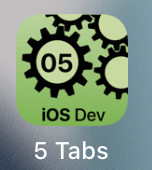

---

---
#### [Home](../../README.md) | [Up](../README.md) | [Overview-Mini-apps](../../demo-apps.md)

---


## Tabs

Demo Projects for Chapter 5 GUI 



```swift
@State private var selection = 0

TabView(selection: $selection){
	LeftView(..).tag(0)
	RightView(..).tag(1)
}
```


[Open the project](./omd-ios-devel-chapter-05-SwiftUI-Tabs.xcodeproj).

---
#### Proceed to [Lists](../Lists/README.md) | Back to [Accessibility](../Accessibility/README.md)

---