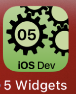

---

---
#### [Home](../../README.md) | [Up](../README.md) | [Overview-Mini-apps](../../demo-apps.md)

---


## SwiftUI - Widgets

In Section Demo Projects for Chapter 5 GUI.




* Output
	* Text: use UTF-8
		* set size to e.g. `.title` or `.footnote`
		* adjust padding 
	* Symbols: take advantage of SF Symbols
	* Images: resize and scale
		* also used: `DisclosureGroup` 

		```swift
		Image(uiImage: self.slide.sunsetImg)
                    .resizable()
                    .aspectRatio(contentMode: .fill)
                    .frame(height: geo.size.width)
                    .clipped()
		```

* Input
	* Textfield
	* Progress
	* Stepper
	* Button

		```
		Button(action: { ... } { Text("...") }
		```
	
	* Toggle
	* Form
	* Pickers

* Colors
	* Slides to adjust 	


	
* Layout
	* Spacer
	* padding
	* Grouping
		* VStack 
		* HStack 
		* ZStack
		* Group

			```swift
			ZStack {
        		Group: do { ..
			``` 
	* Detect size

	```swift
	GeometryReader { geometry in
            ZStack {
                Ellipse()
                .fill(self.bgColor)
                .frame(width: geometry.size.width * 1.4, height: geometry.size.height * 0.33)
                .position(x: geometry.size.width / 2.35, y: geometry.size.height * 0.1)
   ...
   ```
                
	* SafeArea ignore for *Fullscreen*


*Note: Also used on main screen: `GroupBox` and `.dark` color scheme preview.*
	
	
	
[Open the project](./omd-ios-devel-chapter-05-SwiftUI-Widgets.xcodeproj).


---
#### Proceed to [Accessibility](../Accessibility/README.md) 

---