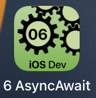
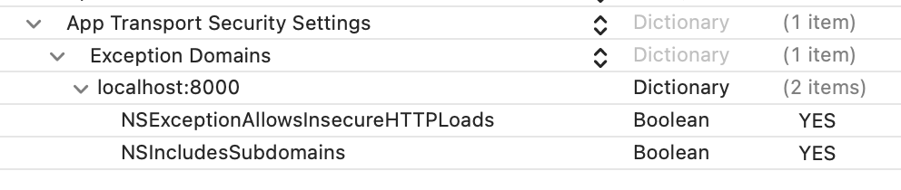

---

---
#### [Home](../../README.md) | [Up](../README.md)  | [Overview-Mini-apps](../../demo-apps.md)


---


## Async/Await

In Demo Projects for Chapter 6 Concurrency 


**Structured Concurrency** is discussed in [study material part A Swift](../../study-material--part-A-Swift.md)

Simple asynchronous functionality might be triggered with **timers**.
Fetch JSON data from a web service in the background (without blocking the main thread) using **async/await**. Then, **deserialise JSON** into memory objects and display them.





### Timer

Create an trigger a timer.

```swift
public let timer = Timer.publish(every: 3, on: .main, in: .common).autoconnect()
```

Execute code when the timer fired.
	
```swift
.onReceive(timer, perform: { _ in
  ...
}
```
	
### Fetch data asynchonously

Note the prerequisites for local tests:

* Allow access of insecure connection (non-https i.e. http traffic) 


	* set exception in info.plist)

	
 
 	```xml
   <dict>
       <key>NSAppTransportSecurity</key>
       <dict>
           <key>NSExceptionDomains</key>
           <dict>
               <key>localhost</key>
              <dict>
                   <key>NSExceptionAllowsInsecureHTTPLoads</key>
                   <true/>
                   <key>NSIncludesSubdomains</key>
                   <true/>
               </dict>
           </dict>
       </dict>
   </dict>
	```
 
 
* Provide demo-data and startup local server
	* For the minimal Python demo see [Static Web Server](../run-heros-api-webservice-locally/README.md):
	* ```/usr/bin/env python3 -m http.server  --directory ./heros-demo-data 8000``` 


Using `Task` you create an scope/environment where suspendable functions can be called. You call an `async` function (see below) and `await` the result (any time in the future). The statements (2) after the Task block might or might not be called earlier or later than a statement after an await statement (1) 
On error, no result is returned, but `nil`.

```swift
Task {
	...
	img = try? await fetchThumbs()
	// (1) ok, we awaited some result (or nil)
	...
}
// (2) further statements
```

A **asynchronous function** can be suspended and resumed by the system. *Note: A resumed function will proceed in the same thread or another.* An async function might return the result any time later (2). When a problem occures, i.e. the asynchrounous function *fails*, we `throw` an error (1).

```swift
enum FetchImageErr: Error { 
	case improperURL 
	case imageDataDecodingError
	...
} 
	
func fetchThumbnail(urlAsString: String) async throws -> UIImage {
	...
	guard let thumbURL = URL(string: urlAsString) else { 
		// (1) async function throws error
		throw FetchImageErr.improperURL 
	}
	...
	// (2) async function returns valid result
	return thumbnailimage
}
```
	
	
	
	
- - -
	
	
* With async/await the suspendable functionality can be written in a linear way without the use of callbacks:


```swift
func fetchThumbnail(urlAsString: String) async throws -> UIImage {
	// check valid URL and prepare request 
	guard let thumbURL = URL(string: urlAsString) else { throw 							FetchImageErr.improperURL 
	}
	let thumbReq = URLRequest(url: thumbURL)
   
	// FETCH DATA and check the HTTP status code returned 
	let (data, response) = try await URLSession.shared.data(for: thumbReq)
	guard (response as? HTTPURLResponse)?.statusCode == 200 else {
	 	throw FetchImageErr.imageError 
	}
	
	// DECODE JSON
   let decoder = JSONDecoder()
   guard let loadedHero = try? decoder.decode(
   			Hero.self, from: data) else {
   			throw FetchImageErr.imageDataDecodingError 
   	} 
	 

	// IMAGE from Base64 String
	let maybeImage:UIImage? = loadedHero.uiimage
	
	
	// CREATE THUMB
   guard let thumbnail = await maybeImage?.thumbnail else {
   		throw FetchImageErr.thumbNailCreationError 
   	}
   
	return thumbnail
}

```
	
	
[Open the project](./omd-ios-devel-chapter-06-Concurrency.xcodeproj).


Open a very simple [async/await playground demo](../241-concurrency-async-await.playground).

Open a [json deserialisation playground demo](../250-net-consuming-json.playground).


---
#### Proceed to [GCD](../GCD/README.md) | Back to [Chapter 05 GUI](../../chapter-05-gui/README.md)

---