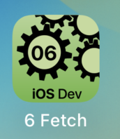

---

---
#### [Home](../../README.md) | [Up](../README.md) | [Overview-Mini-apps](../../demo-apps.md)

---


## Fetch Data/Images (async)

In Section Demo Projects for Chapter 6 Concurrency.




Load image in the background.

```swift
AsyncImage(url: url) { image in
	image
		.resizable()
		.aspectRatio(contentMode: .fill)
		.frame(width: 150, height: 150)
		.clipShape(Rectangle())
}
```
 	
	
[Open the project](./omd-ios-devel-chapter-06-Fetch.xcodeproj).


---
#### Proceed to [Localisation](../Localisation/README.md) | Back to [Navigation](../Navigation/README.md)

---