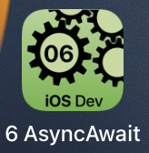
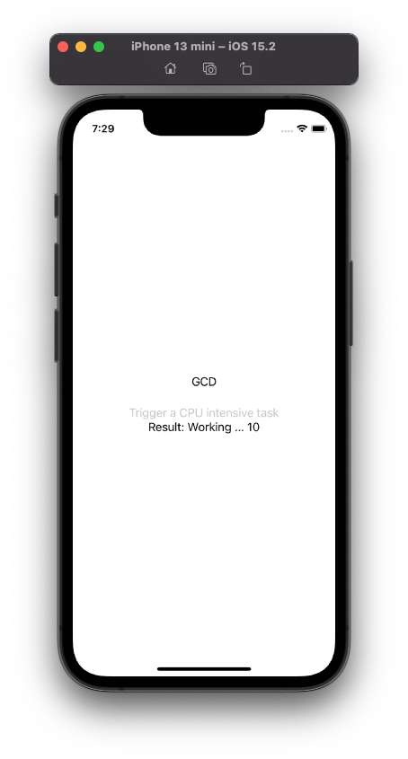
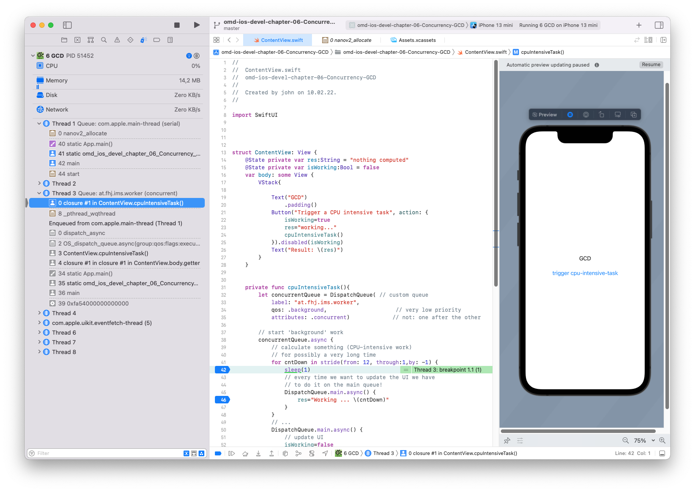
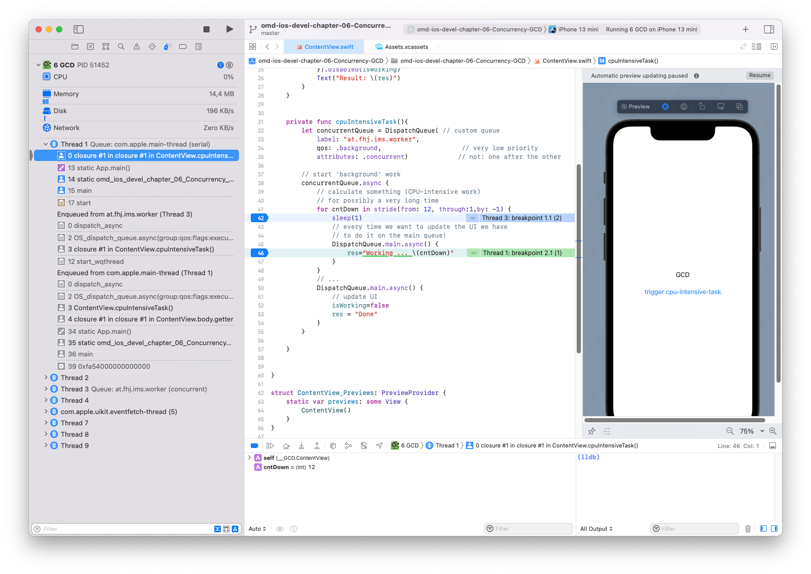

---

---
#### [Home](../../README.md) | [Up](../README.md)  | [Overview-Mini-apps](../../demo-apps.md)


---


## Grand Central Dispatch

In Demo Projects for Chapter 6 Concurrency 






	
* Start long lasting tasks in background queues and later "go" back to the main tread to update the UI:

```swift
// prepare
let concurrentQueue = DispatchQueue( // custom queue
    label: "at.fhj.ims.worker",
    qos: .background, 					// very low priority
    attributes: .concurrent) 			// not: one after the other

// start 'background' work
concurrentQueue.async {
    // calculate something (CPU-intensive work)
    // for possibly a very long time
	 // ...
    DispatchQueue.main.async() { 
    	// update UI
    	...
    }
}

``` 

Set debug breakpoints to check code execution in the background thread:




Code in the main thread is allowed to modify the UI:


	
	
[Open the project](./omd-ios-devel-chapter-06-Concurrency-GCD.xcodeproj).

Open a [playground mini demo](../240-gcd.playground).


---
#### Proceed to [Chapter 07 Persistency](../../chapter-07-Persistency/README.md) | Back to [Concurrency](../Concurrency/README.md)

---