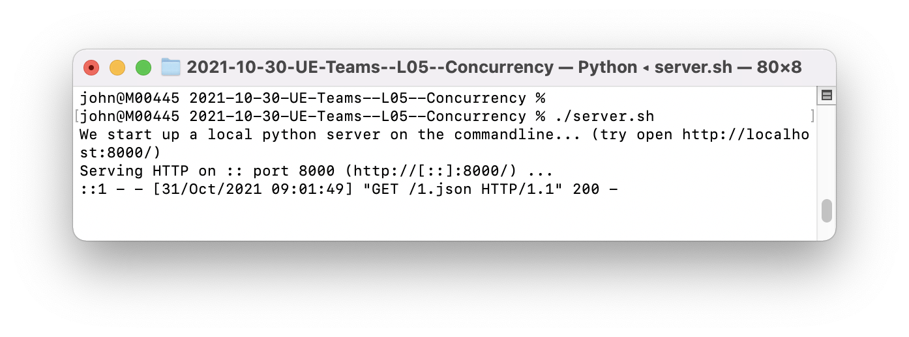
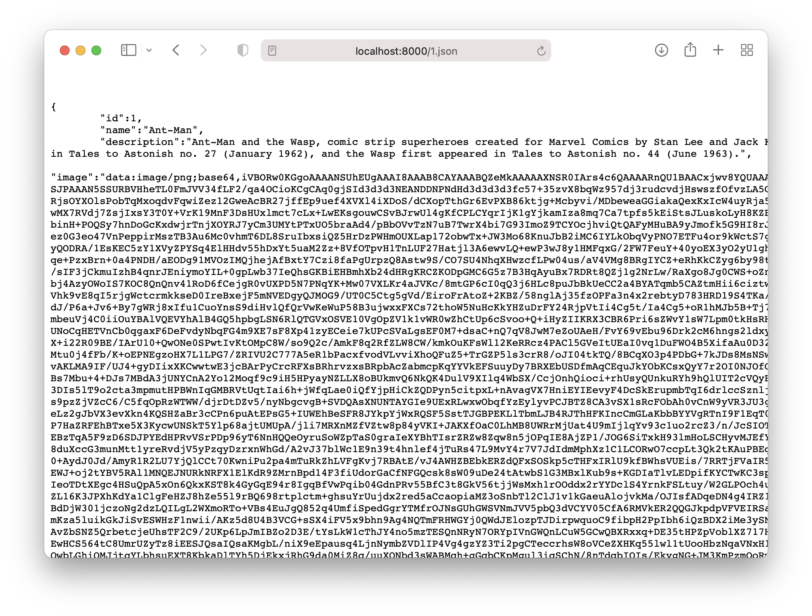

---

---
#### [Home](../../README.md) | [Up](../README.md) | [Overview-Mini-apps](../../demo-apps.md)

---

## Local Static Web Server

How to startup local HERO API web service server:

* run ```server.sh```

 


Note: this just executes

```bash
/usr/bin/env python3 -m http.server  --directory ./heros-demo-data 8000
```

* Try in Browser

  <http://localhost:8000/>


