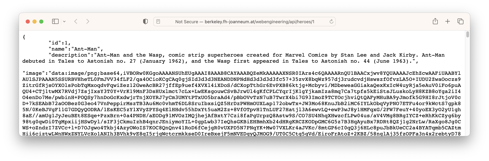

# Use existing webservice


### Example by M. Knoll

**FH INTERN**

<http://berkeley.fh-joanneum.at/webengineering/>


Example request for hero number 1:

* In your browser <http://berkeley.fh-joanneum.at/webengineering/api/heroes/1> 

* With Curl

	```bash
	curl http://berkeley.fh-joanneum.at/webengineering/api/heroes/1
```

	* Returns his id, name, description and (base64-encoded) image in json format:

		```json
		{
			"id":1,
			"name":"Ant-Man",
			"description":"Ant-Man and the Wasp, comic strip superheroes created for Marvel Comics by Stan Lee and Jack Kirby. Ant-Man debuted in Tales to Astonish no. 27 (January 1962), and the Wasp first appeared in Tales to Astonish no. 44 (June 1963).",
			"image":"data:image/png;base64,iVBORw0KGgoAAAANSUhEUgAAAI8AAAB8CAYAAABQZeMkAAAAAXNSR0IArs4c6QAAAARnQU1BAACxjwv8YQUAAAAJcEhZcwAAFiUAABYlAUlSJPAAAN5SSURBVHheTL0FmJVV34f....AElFTkSuQmCC"
		}
		```