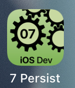

---

---
#### [Home](../../README.md) | [Up](../README.md)  | [Overview-Mini-apps](../../demo-apps.md)


---


## O/R-M

Demo Projects for Chapter 7 Persistency 




### User Defaults (key-value store)

Saving simple (key-value) data to persistent story into the *user defaults* (shared prefs) **key value** store.

* Just annotate a variable with `@AppStorage` is enough to persist any changes.


	```swift
	@AppStorage("email")
	private var email: String = "?"
	```


### Core Data (with ORM)

Object-relational mapping (O/R-M) with **Core Data**. 

* A few steps are necessary to set up the infrastructure

	* create a *XCDataModel* and configure entities and relationships. This is mapped to a relational database. 

	* Inject a persistence context into the environment on startup. (Some boilerplate code is necessary to set up all the needed *NSManagedObjectContext*, *PersistenceController* , *NSPersistentContainer*)

	
	```swift
	let persistenceController = PersistenceController.shared
	... 
	ContentView()
       .environment(\.managedObjectContext,
                    persistenceController.container.viewContext)
	```
	
	* For manipulating data (in memory) within a view, use `@FetchRequest`s and `FetchedResults` in your code to get data from the persistent storage. To save (in memory) manipulated data (e.g. `viewContext.delete`) to the persistent store use `viewContext.save()`.

	```swift
	@Environment(\.managedObjectContext) private var viewContext
	...
	@FetchRequest(...)
	private var items: FetchedResults<Photo>
	...
	
	try viewContext.save()
	```
	

[Open the project](./omd-ios-devel-chapter-07-Persistency.xcodeproj).

---
#### Proceed to [Chapter 08 Location](../../chapter-08-location/README.md) | Back to [Chapter 06 Concurrency](../../chapter-06-concurrency/README.md)

---