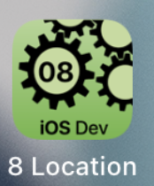
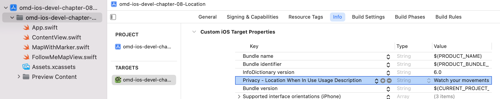
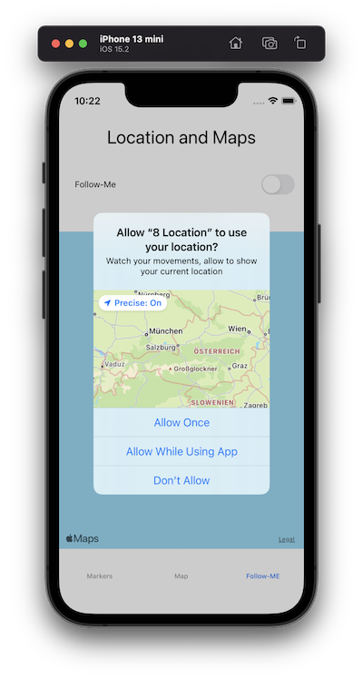
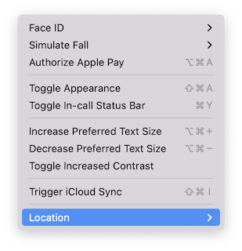
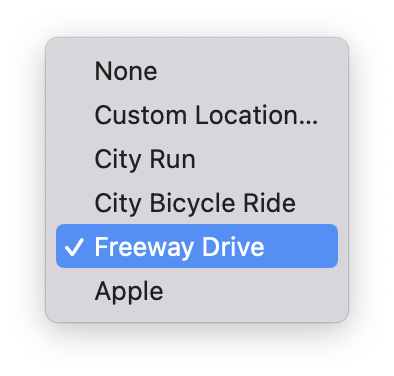

---

---
#### [Home](../../README.md) | [Up](../README.md) | [Overview-Mini-apps](../../demo-apps.md)

---


## Location and Maps

Demo Projects for Chapter 8 Location




### Show a Map

* Show a map with **Point of Interest** (POI) as Annotations:

	```swift
	struct ContentView: View {
	// ...
    var body: some View {
      // ...
            Map{
                Annotation(
                     "Home",
                     coordinate: CLLocationCoordinate2D(
                      latitude: 47.3,
                      longitude: 15.5)
                ){
                    Image("house.fill")
                }
            }
      // ...
    }
	```

### Track current position

* Permissions: **Allow** app to use current location. In `Info.plist` add entry **Privacy - Location When In Use Usage Description**:




* Add Map and initialise with auto-update to current position

```swift
struct FollowMeMapView: View {
  // ...
  @State var position: MapCameraPosition = .userLocation(fallback: .automatic)
  // ...
  var body: some View {
		// ... 	
		Map(position: $position)
   	//..
 }
}
```


* When running the app, users are asked to allow accessing the current user location

	


* Simulate location 


	


	


[Open the project](./omd-ios-devel-chapter-08-Location.xcodeproj).


---
#### Proceed to [Chapter 09 Animation](../../../chapter-09-animation/README.md) | Back to [Chapter 07 Persistency](../../chapter-07-persistency/README.md)

---	