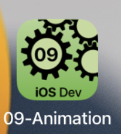

---

---
#### [Home](../../README.md) | [Up](../README.md) | [Overview-Mini-apps](../../demo-apps.md)

---


## 2D Animation

Demo Projects for Chapter 9 Animation 



### Declarative animations

Modify a value to animate views:

```swift
@State private var sizeInPercent = 0.7

...

Text(..)
	.animation(
		.easeInOut(duration: 3.0), 
					 value: sizeInPercent)
```

Tap buttons to animate views:

```swift
@State var thumbsUp:Bool=false

...

Button(action: {
	withAnimation (.easeInOut(duration: 3)) {
		thumbsUp.toggle()
	} 
}, label: {
	Label("Up/down", systemImage: "arrow.up.and.down.and.sparkles")
})

...

Text("👎").rotationEffect(.degrees(thumbsUp ? 180 : 0))
```


Experiment with various effects:

```swift
@State var showDetail:Bool=false

...

.rotationEffect(.degrees(showDetail ? 90 : 0))
.scaleEffect(showDetail ? 1.5 : 1)

.transition(.scale(scale: 0.1))

.animation(Animation.spring(response: 0.2, dampingFraction: 0.2, blendDuration: 1.2), value: showDetail)
```

Draw your custom elements

```swift
Path { path in
  path.move(   to: CGPoint(x: 100, y: 100) )
  path.addLine(to: CGPoint(x: 200, y: 100) )
  // ...
  }
```


[Open the project](./omd-ios-devel-chapter-09-Animation.xcodeproj).

---
#### Proceed to [Chapter 10 Sensors](../../../chapter-10-sensors/README.md) | Back to [Chapter 08 Location](../../chapter-08-location/README.md)

---	