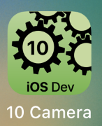
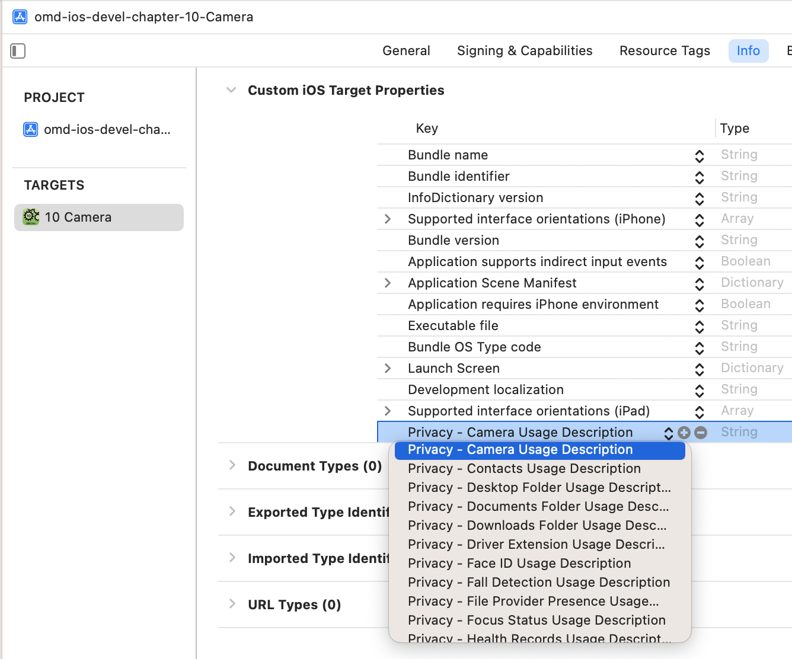
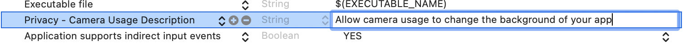

---

---
#### [Home](../../README.md) | [Up](../README.md) | [Overview-Mini-apps](../../demo-apps.md)

---


## Camera


Demo Projects for Chapter 10 Sensors 



## Prepare for Privacy

* Privacy

	* Ask user to access the camera

	

	


## Any view in our main application

* provide default image (from asset)

	```swift
   @State private var img:UIImage =
     UIImage(imageLiteralResourceName: "default")
	```
	
	```swift
	var body: some View {
     VStack {
       Image(uiImage: img)
       ...
	```


## A (reusable) View to take a shot 

* Add view to be shown when tapping the image

	* New File of type **SwiftUI View**: `CamSwift.swift`

	```swift
	struct CamView: View {
	    @Binding var theImage:UIImage
	    var body: some View {
	        Text("TODO")
	    }
	}
	
	struct CamView_Previews: PreviewProvider {
	    @State static var demoImage = UIImage(imageLiteralResourceName: "default")
	    static var previews: some View {
	        CamView(theImage: $demoImage)
	    }
	}
	```

* Show view (as overlay/sheet) on tapping the image

	```swift
	struct ContentView: View {
		...
		@State private var showCam = false
	```

	```swift
	struct ContentView: View {
		...
		var body: some View {
			...	
			Image(uiImage: img)
				.onTapGesture {
		         showCam = true
   }
   ...
	```
	
	```swift
	struct ContentView: View {
		...
		var body: some View {
	        VStack {
	        	...
	        	...
			 }.sheet(isPresented: $showCam) {
	            CamView(theImage: $img)
	        }
	```


	```


[Open the project](./omd-ios-devel-chapter-10-Camera.xcodeproj).

---
#### Proceed to [Chapter 11 Security](../../chapter-11-security/README.md) | Back to [Chapter 09 Animation](../../chapter-09-animation/README.md)

---