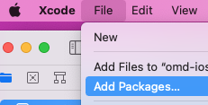
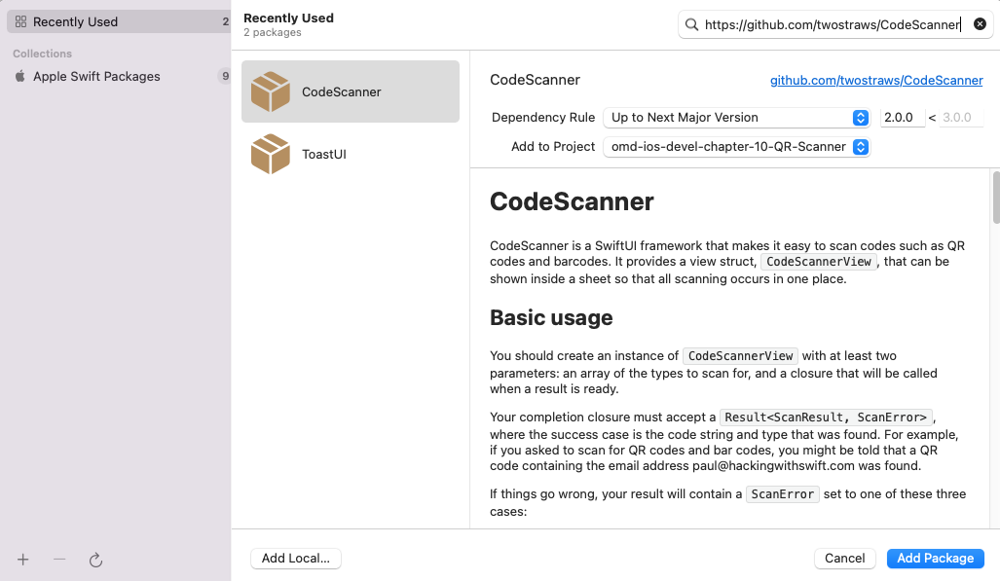

---

---
#### [Home](../../README.md) | [Up](../README.md) | [Overview-Mini-apps](../../demo-apps.md)

---

## QR Code Scanner

Demo Projects for Chapter 10 Sensors 

## Requirements

Add package **CodeScanner** from <https://github.com/twostraws/CodeScanner>: Xcode Menu File Add Packages... 

... then paste the url into the top right search field as shown in following screenshots:

[Open the project](./omd-ios-devel-chapter-10-QR-Scanner.xcodeproj).

---
#### Proceed to [Chapter 12 Services](../../chapter-12-services/README.md) | Back to [Chapter 09 Animation](../../chapter-09-animation/README.md)

---