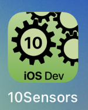

---

---
#### [Home](../../README.md) | [Up](../README.md) | [Overview-Mini-apps](../../demo-apps.md)

---


## Sensors (with raw data)


Demo Projects for Chapter 10 Sensors 




### Sensors

Provide environmental data or minimise user input by using sensors. 

The **Core Motion** APIs provide access (*periodic* sampling) to different device sensors, such as 

* Accelerometer
* Gyroscope
* Magnetometer
* Device-motion


Use **only ONE** CoreMotion Manager for the app.

* Barometer to get air pressure and relative altitude


	check if available
	
	```swift
	guard CMAltimeter.isRelativeAltitudeAvailable()...
	
	// CoreMotion Altimeter
	let altimeter = CMAltimeter()
	```
	
	start polling
	
	```swift
	// Core Motion polls the barometer in regular intervals
	altimeter.startRelativeAltitudeUpdates(to: OperationQueue.current!) {
            (data, error) in
	
			guard error == nil,
        		let data = data else { ...
	
			// Elevation change (= relative altitude) since start:
            let relVal = String(
                format: "%0.02f",data.relativeAltitude)
            self.relativeAltitude = "Since start: Δm = \(relVal)m"
			...
	}
	```
	
	stop polling
	
	```swift
	altimeter.stopRelativeAltitudeUpdates()
	```
	
* Proximity


	prepare a callback (to get triggered on events)
	
	```swift
	class ProximityObserver {
	        
	        @objc
	        func didChange(notification: NSNotification) {
	            guard let device = notification.object as? UIDevice else { return }
							            
	            state = device.proximityState ? "near": "far"
	        }
	    }
	```


	register for callback (notify an observer)
	
	```swift
	NotificationCenter
	            .default
	            .addObserver(
	                proximityObserver,  
	                selector: #selector(proximityObserver.didChange), 	                name: UIDevice.proximityStateDidChangeNotification, 	                object: UIDevice.current
	            )
	```


#### CoreMotion

CoreMotion manages the gyroscope and the accelerator

* Gyroscope (x/y/z - position)

	```swift
	import CoreMotion

	private let motion = CMMotionManager()
	```

	Gyro available?

	```swift
	guard motion.isGyroAvailable else {...  
	```
	
		
	Configure and start gyro updates and a timer to peridic get the values:

	```swift
	self.motion.gyroUpdateInterval =  3 // in sec
   self.motion.startGyroUpdates()
	
	self.gyroTimer = Timer(fire: Date(),interval:  3,
	                       repeats: true, block: { _ in
	            print("DEBUG \(Date()) we got: \(self.motion.gyroData.debugDescription)")
	            ...
	})
	// if timer setup worked, we start the timer (i.e. add to run loop of current thread
	guard let tmr = self.gyroTimer else { ...
	RunLoop.current.add(tmr, forMode: RunLoop.Mode.default)
	```

	To save energy / resources, do not forget to stop the timer (remove timer) and stop core motion updates.
	
	```swift
	tmr.invalidate()
	self.gyroTimer = nil
	self.motion.stopGyroUpdates()
	```

* Accelerator

	```swift
	// see code for gyro above 
	// and replace every occurence of "gyro" with "accelerometer".
	``` 
### Actuators: 

Provide user feedback with actuators.

* Vibration


[Open the project](./omd-ios-devel-chapter-10-Sensors.xcodeproj).

---
#### Proceed to [Chapter 12 Services](../../chapter-12-services/README.md) | Back to [Chapter 09 Animation](../../chapter-09-animation/README.md)

---