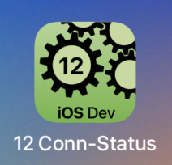

---

---
#### [Home](../../README.md) | [Up](../README.md) | [Overview-Mini-apps](../../demo-apps.md)

---

## Connection Status

In Demo Projects for Chapter 12 System Services

* Start a *Monitor* to get notified when cellular (or wifi) connections are enabled or disabled. Currently not supported by the iOS Simulator.

[Open the project](./omd-ios-devel-chapter-12-ConnectionStatus.xcodeproj).

---
#### Back to [Chapter 10 Sensors](../../chapter-10-sensors/README.md)

---