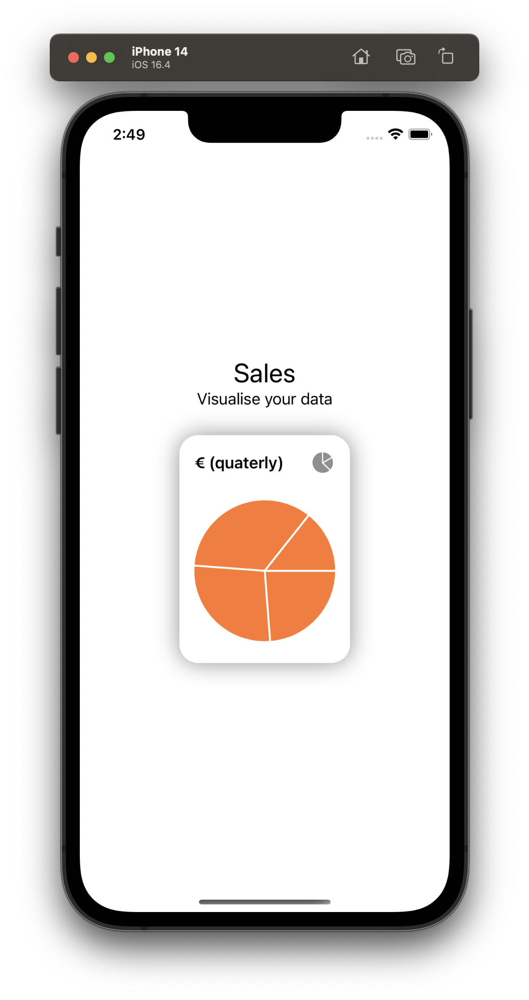
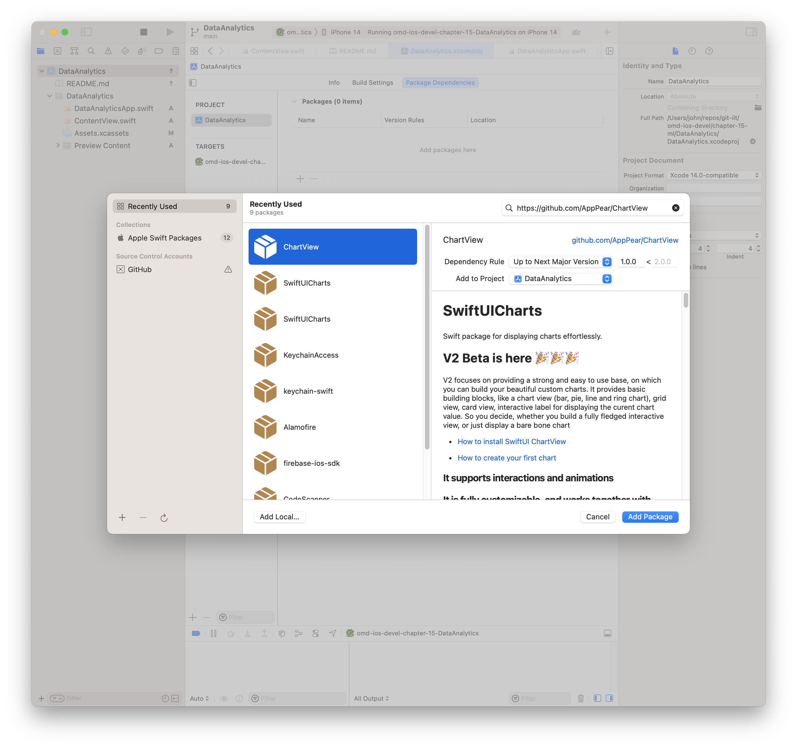

---

---
#### [Home](../../README.md) | [Up](../README.md) | [Overview-Mini-apps](../../demo-apps.md)

---


## Data Analytics

In Demo Projects for Chapter 15 Machine Learning (ML), Data Analystics, and Data Visualisation.




### Install the **dependencies**

Select a Charting Library you want to use and add the package as dependency:

* Copy URL, such as <https://github.com/AppPear/ChartView>

* Add Package dependency for your project. Enter the url `https://github.com/AppPear/ChartView` in the right to corner (the search field):
    
	
    

Consider alternatives:

* <https://github.com/mecid/SwiftUICharts>

* <https://github.com/willdale/SwiftUICharts>

* Check out [Apple Charts](https://developer.apple.com/documentation/charts/creating-a-chart-using-swift-charts)
    
    
### Use the Chart 

Import

	
```swift
import SwiftUICharts
```

Prepare Data

```swift
struct Sales{
let year:Int
let quater:Int
let euro:Double
let cnt:Int
}
	
let quaterlySales:[Sales] = [
    Sales(year:2033,quater:1,euro:200.01, cnt: 400),
    Sales(year:2033,quater:2,euro:230.30, cnt: 40),
   ...
]
```

Draw the chart    
    

```swift
 PieChartView(data: quaterlySales.map { $0.euro }, ...)
```


[Open the project](./DataAnalytics.xcodeproj).
	
---
#### Back to [Chapter 12 System (Services)](../../chapter-12-system/README.md)

---
