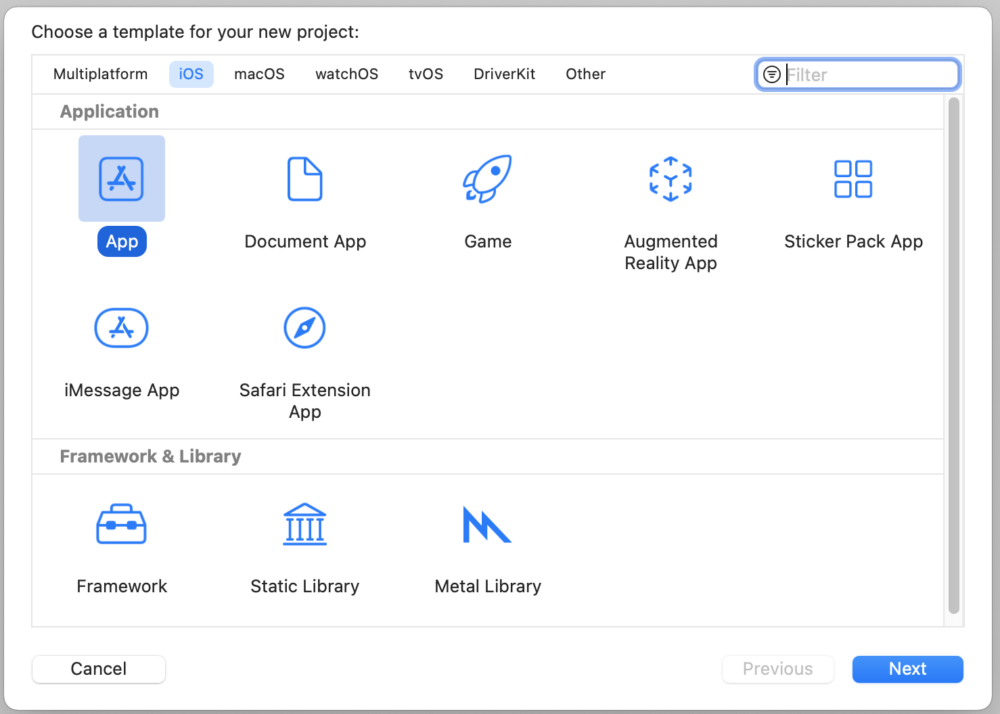
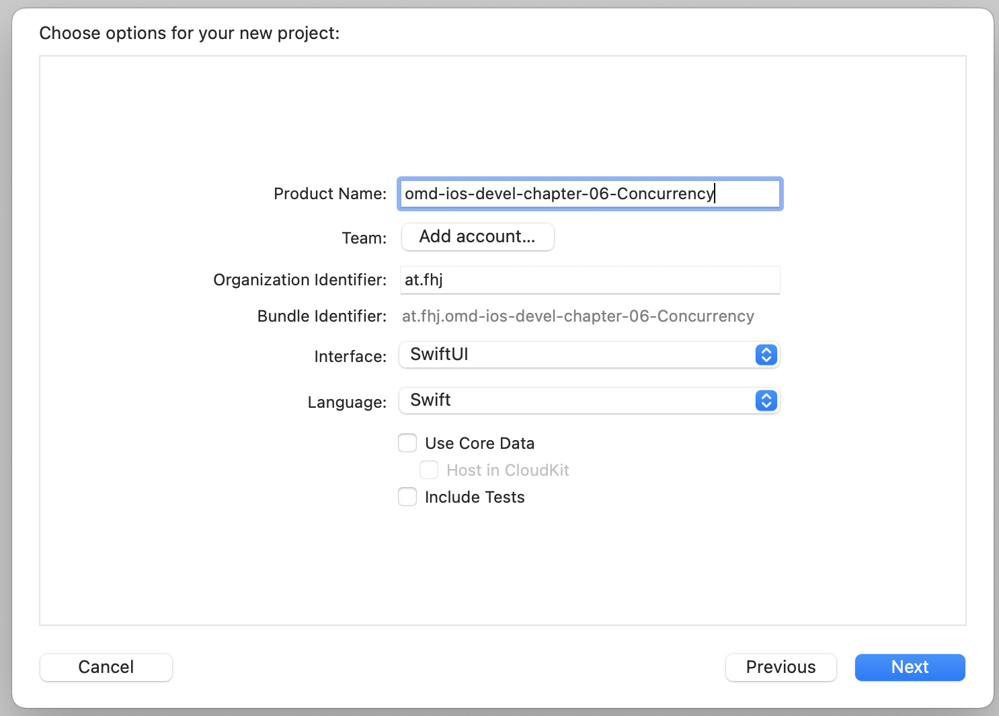
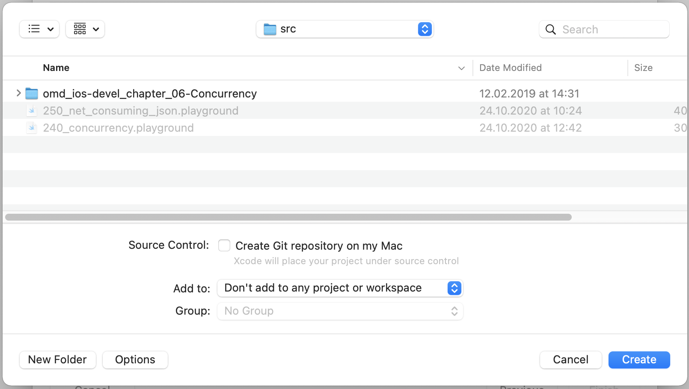
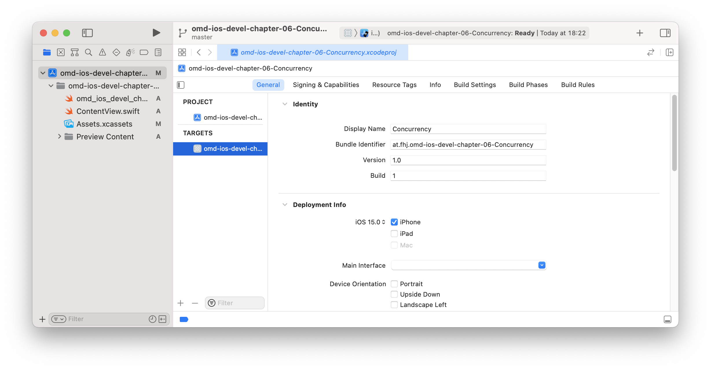

---

---
##### [Home](./README.md) | [Overview-Mini-apps](./demo-apps.md)

---


# Appendix


## Add Another Demo App

A *Mini Guide* to add some more code (i.e. adding demo applications).


For example, you have another demo on Accessibility

* 1 Find the suiting chapter to add the applications
	* Here: ```chapter-05-gui``` 


* 2 Change to subdirectory ```chapter-05-gui```
	* Here ```cd chapter-05-gui```

* 3 Create a brand new project
	
	* 3a Xcode - Menu: ```File/New/Project...```
	
	* 3b Choose Type of project
		* Very often just a ```iOS / App```
		
		
	
	* 3c Configure new project
		* Product Name ```omd-ios-devel-chapter-05-SwiftUI-Widgets``` 
		* Team: ```None```
		* Organisation Identifier: ```at.fhj```
		* Language: ```swift```
		* User Interface: 
			* Here: ```swiftUI``` 
		* Unselect ```Use Core Data```, ```Include Tests```

		
		
	* 3d Save (without creating git repo!) in current directory
		* Here: ```chapter-05-gui```
		* Untick ```Create Git repository on my Mac``` 
		* Add to ```Don't add to ```

		
		
	* 3e Change the Display Name to be prettier
		* Here: ```5 Widgets``` 

		

	* 3f Remove the default AppIcon assets and copy over pretty *AppIcon* assets (by Mathias Knoll)
		* Here: copy over the assets from the [dir](./demo-apps--app-icons/chapter-05/iOS/), which show number ```05``` in the images, e.g.: 
			* ```./demo-apps--app-icons/chapter-05/iOS/AppIcon.appiconset/```. 

* Modify and run / test the project
	* Add some more source code files 
	
## Finally, Update the README.md files

See [Home](./README.md).

* E.g. if you add an app for *Chapter 05 GUIs*
	* **Update** file [Ch 5 GUIs](./chapter-05-gui/README.md)  in Chapter 5, i.e. subdir ``` ./chapter_05-gui/src/ ```.
	* **Create** file [**README.md**](./chapter-05-gui/Widgets/README.md) in 
		* subdir ```./chapter-05-gui/Widgets/```.
		* Include some screenshots in subdir ```screenshot``` again within the project directory 
		* (e.g. ```./chapter-05-gui/Widgets/```)

- - - 
		
*This is the README-How-To-Add-Demo-Apps.md of <https://git-iit.fh-joanneum.at/omd/ios-devel/>.*
