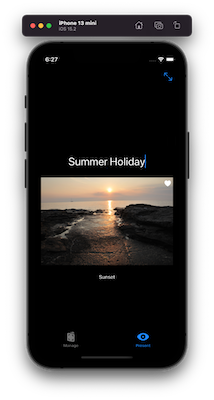

---

---
#### [Home](./README.md)

---

# iOS Mini Apps #

A source code driven tutorial to speed up mobile development.

This repository includes many working **mini apps**. Every source code shown works, as the source code is taken from the mini apps.

| Section  | Demo-App  | Minimal Implementation of |  |
|:------------- |:---------------| -------------|----| 
| [Ch 1 Intro](./chapter-01-intro/README.md)      |  [Package Manager](./chapter-01-intro/PackageManager/README.md)  |        Using Swift Packages |  |
| |     [Life-Cycle](./chapter-01-intro/AppLifeCycle/README.md) | React on life-cycle events, e.g. stop activities when the app is inactive. | 
| |      [SlideShow](./chapter-01-intro/SlideShowApp/README.md) + [Refactoring](./chapter-01-intro/SlideShowApp-Refactoring/README.md) | **Step-by-step** creating an app: start with model, add service, inject objects into the environment, use two-way data binding. Then **Refactor** by extracting views. | |
| [Ch 2 Testing](./chapter-02-testing/README.md)     | [Unit Testing](./chapter-02-testing/UnitTesting/README.md) | Test functionality of your classes. Test concurrent async/await code when fetching remote data. |
|  |    [Performance ](./chapter-02-testing/UnitTestingWithPerformanceMeasuring/README.md)    | Unit testing and performance metering |
|  |   [UI Testing](./chapter-02-testing/UITesting/README.md) | Test the User Interfaces by automating user interaction and check the resulting modifications. |
| [Ch 5 GUIs](./chapter-05-gui/README.md)                       | [Widgets](./chapter-05-gui/Widgets/README.md) | Use declarative programming to define user interfaces. Use *widgets* (or *views*) such as: buttons, text, images, Forms, pickers, toggles, sliders. |
|  |          [A11y and UI Testing](./chapter-05-gui/Accessibility/README.md)  | Accessibility and UI Testing |
|  |          [Tabs](./chapter-05-gui/Tabs/README.md)           | Navigation between views with a Tab Bar|
|  |         [Lists](./chapter-05-gui/Lists/README.md)          | Scrollable lists with detail view for the list entries. |
|  |    [Navigation](./chapter-05-gui/Navigation/README.md)     | Different ways to navigate to other views: show overlays, reveal a detail view or show alerts. |
|  |       [Layouts](./chapter-05-gui/Layouts/README.md)        | Groups, Stacks, Spacers. Adding padding and ignoring the SafeArea. |
|  |          [L10n](./chapter-05-gui/Localisation/README.md)   | Localisation. Translate the user interface to multiple languages. |
|  |  [Data Binding](./chapter-05-gui/DataBinding/README.md)    | Two-way data binding and observing your model data.|
| [Ch 6 Concurrency](./chapter-06-concurrency/README.md)     | [Concurrency](./chapter-06-concurrency/Concurrency/README.md) | Timers. Background tasks, e.g. fetch data from web services with suspendable functions: async/await. |
|  |   [GCD](./chapter-06-concurrency/GCD/README.md) | Grand Central Dispatch (queues for explicit multithreading). |
| [Ch 7 Persistency](./chapter-07-persistency/README.md)     | [O/R-M](./chapter-07-persistency/Persistency/README.md) | Save state with *AppStorage* or manage larger data using Object-relational mapping with Core Data. |
| [Ch 8 Location   ](./chapter-08-location/README.md)        | [Map](./chapter-08-location/Location/README.md) | Location and Map.|
| [Ch 9 Animation  ](./chapter-09-animation/README.md)       | [2D-Animation](./chapter-09-animation/Animation/README.md) | Declarative animations in 2D. |
| [Ch 10 Sensors   ](./chapter-10-sensors/README.md)         | [Raw Sensors](./chapter-10-sensors/Sensors/README.md)        |  Sensors (Proximity, Barometer, Accelerometer, Gyroscope) and Actuators (Vibration) |
|   | [Camera](./chapter-10-sensors/Camera/README.md)        |           Camera |
|   | [QR-Code](./chapter-10-sensors/QR-Scanner/README.md)   |           QR-Code Scanner |
| [Ch 12 Services  ](./chapter-12-system/README.md)          | [URL Schemes](./chapter-12-system/URLSchemes/README.md)        |   Open App via URL |
|  |       [Sharing](./chapter-12-system/Sharing/README.md)     |   Share View or share via Mail. |
| [Ch 14 Notifications](./chapter-14-notifications/README.md)          | [Local Notifications](./chapter-14-notifications/LocalNotifications/README.md)        | Schedule notifications to appear in the notifications center. |  |
| [Ch 15 ML](./chapter-15-ml/README.md)          | [Image Classification](./chapter-15-ml/ImageClassification/README.md)        | Use custom created machine learning models to classify fruit images. |  |

**Intern:** How to add more demo apps. Read the [how to](./demo-apps-how-to-add-another-app.md) before adding more demo apps.

### What is very special about Swift

| Section  | Demo-Playground  | Minimal Implementation of |  |
|:------------- |:---------------| -------------|----| 
| [Ch 3a Swift I (Basics)](./chapter-03-swift/README.md)  | [Structs](./chapter-03-swift/021-Datatypes--structs.playground) | Structs are preferred to classes. Code is short, but the instances are equipped with powerful functionality. Typically, in Swift additional functionality (even for existing structs, protocols, classes) can be add later by using **Extensions** |
|  | [Optionals](./chapter-03-swift/045-Optionals.playground) | Normally, all the variables must always have value. They **must not** be `nil`. If varables can **optionally** be `nil`, the type must be a **nullable** type, ie. `String?` and not `String`, `GPS?` and not `GPS`, and `Boolean?` instead of `Boolean` |
| | [Closure](./chapter-03-swift/150-Closure.playground) | Small code of blocks (similar to anonymous functions, but including the surrounding context) are called *closures*. Closures are very handy in functional programming where we pass functions as parameters. For example, pass some code as a closure to a  `sort` method. Thereby, you can specify the way a sort algo decides which of tho values is the larger one.| 
| [Ch 3b Swift II (Advanced)](./chapter-03-swift/README.md)  | [Guard](./chapter-03-swift/060b-Error-handling--guard.playground) |  At the *beginning* of a function, check (user) input and return early if any parameter has an unexpeced value.  |
| | [Property Observers](./chapter-03-swift/111-OO--observers.playground) | When inner values (*properties* of an instance) are changed, code can be executed. Override the `willSet` and/or the `didSet` methods for a property. | 
| | [Lazy Properties](./chapter-03-swift/110-OO--Lazy-properties.playground) | An actual value is set to the property **on first use**. You are expected to know how the garbage collector works, because **Automatic Reference Counting** (ARC) requires you to use in some locations **unowned** references. | 

### Examples in Playgrounds

| Section  | Demo-Playground  | Minimal Implementation of |  |
|:------------- |:---------------| -------------|----| 
| Ch 5 GUI | [Alerts](./chapter-05-gui/ShowToastMessage.playground) | Graphical user interfaces can be designed and tested in playgrounds also. For example, showing alerts. |
| Ch 5 GUI | [Environment](./chapter-05-gui/Environment.playground) | Putting custom objects into the environment of views (using `EnvironmentKey`, i.e. custom Environment keys) and access it via custom key-path. | 
| Ch 6 Concurrency | [async/await playground](./chapter-06-concurrency/241-concurrency-async-await.playground) | Suspendable tasks with Async/Await. | 
| | [JSON deserialisation playground](./chapter-06-concurrency/250-net-consuming-json.playground).| Consuming web services and serialising and deserialising JSON into objects in memory. | 
| | [Grand Central Dispatch (GCD) playground](./chapter-06-concurrency/240-gcd.playground). | Explicit multithreading concurrency with queues of the Grand Central Dispatch (GCD). | 
| [Ch 11 Secure Coding](./chapter-11-security/README.md) | [Input Validation with RegEx](./chapter-11-security/Secure-coding--re-input-validation.playground) | Use regular expression to validate user input. | 
| | [Unsafe Pointers](./chapter-11-security/Insecure-coding--unsafe-pointers.playground). | Insecure coding with pointers. | 
| | [Reverse Engineering, Forensics](./chapter-11-security/). | Scripts and tools for reverse engineering and forensic inspections. |              

---
##### This is the README.md of <https://git-iit.fh-joanneum.at/omd/ios-devel>.

--- 

