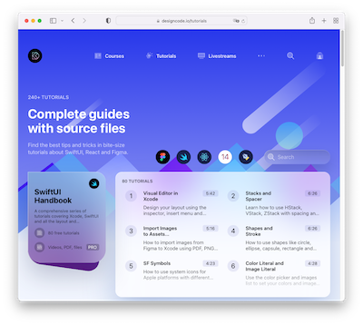
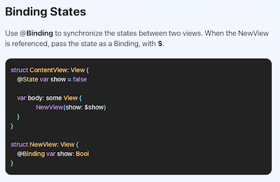
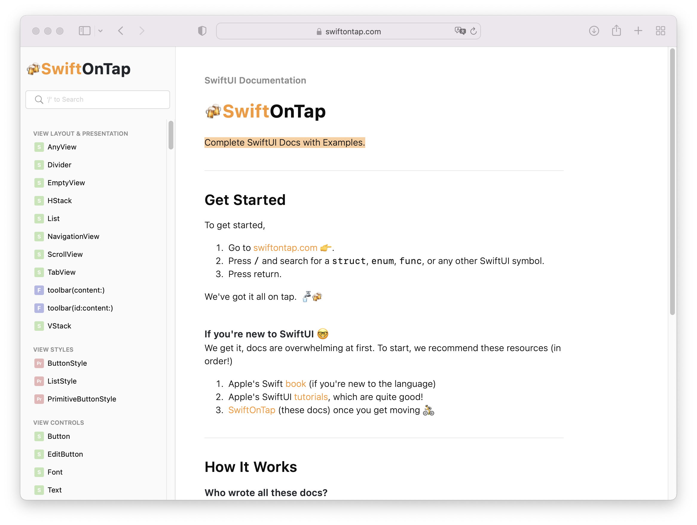
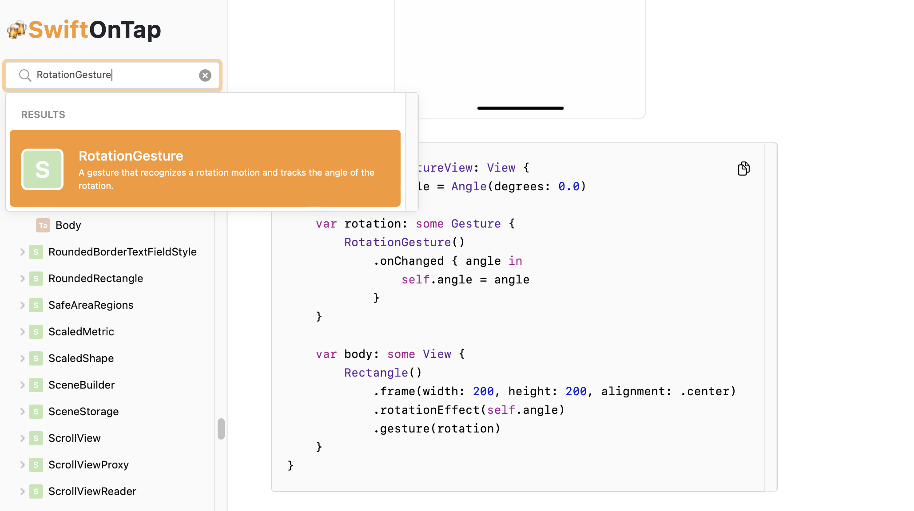

---

---
#### [Home](./README.md) | [Overview](./study-material--overview.md)

---

# Links 

> "Learning and innovation go hand in hand. The arrogance of success is to think that what you did yesterday will be sufficient for tomorrow." — William Pollard

## Swift and SwiftUI Demo Code

* SwiftUI Handbook:
	* A collection of more then 80 very short tutorials on SwiftUI.
	
		
	
	* <https://designcode.io/swiftui-handbook>
	* For example: [**Binding**](https://designcode.io/swiftui-handbook-binding) explains State variables to trigger changes on the UI.
		
		

	 
* Swift On Tap
	* Documentation by small examples including a preview.
	
		
	
	* <https://swiftontap.com/>
	* For example: [Rotation Gesture](https://swiftontap.com/rotationgesture) explains the user interaction to trigger rotation of shapes.
	
		

--- 
#### [Back to the overview](./study-material--overview.md)
---